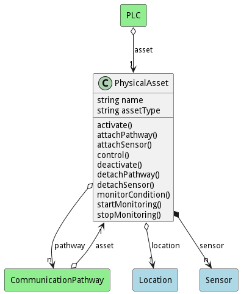

# PhysicalAsset

Description 

## Attributes

* name:string - Name of the the physical asset
* assetType:string - The Type of Asset

## Associations

| Name | Cardinality | Class | Composition | Owner | Description |
| --- | --- | --- | --- | --- | --- |
| location | 1 | Location | false | false |  |
| sensor | n | Sensor | true | true |  |
| pathway | n | CommunicationPathway | false | false |  |

## Users of the Model

| Name | Cardinality | Class | Composition | Owner | Description |
| --- | --- | --- | --- | --- | --- |
| asset | 1 | CommunicationPathway | false | false |  |
| asset | 1 | PLC | false | false |  |

## Methods
* [control() - Description of the method](#action-control)
* [startMonitoring() - Description of the method](#action-startMonitoring)
* [stopMonitoring() - Description of the method](#action-stopMonitoring)

<h2>Method Details</h2>
    
### Action physicalasset control

* REST - physicalasset/control?attr1=string
* bin - physicalasset control --attr1 string
* js - physicalasset.control({ attr1:string })

#### Description
Description of the method

#### Parameters

| Name | Type | Required | Description |
|---|---|---|---|
| attr1 | string |false | Description for the parameter |

### Action physicalasset startMonitoring

* REST - physicalasset/startMonitoring?attr1=string
* bin - physicalasset startMonitoring --attr1 string
* js - physicalasset.startMonitoring({ attr1:string })

#### Description
Description of the method

#### Parameters

| Name | Type | Required | Description |
|---|---|---|---|
| attr1 | string |false | Description for the parameter |

### Action physicalasset stopMonitoring

* REST - physicalasset/stopMonitoring?attr1=string
* bin - physicalasset stopMonitoring --attr1 string
* js - physicalasset.stopMonitoring({ attr1:string })

#### Description
Description of the method

#### Parameters

| Name | Type | Required | Description |
|---|---|---|---|
| attr1 | string |false | Description for the parameter |

