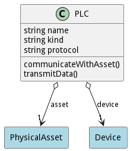
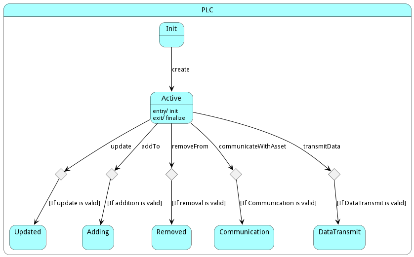

# PLC

The &#34;PLC&#34; class, located in the &#34;pw&#34; package, represents a Programmable Logic Controller that has methods for creating, destroying, updating, and manipulating data, and it is capable of communication with assets and devices using a specific protocol.

## Attributes

* name:string - Unique identifying name of the PLC
* kind:string - Type or model of the PLC
* protocol:string - Communication protocol used by the PLC

## Associations

| Name | Cardinality | Class | Composition | Owner | Description |
| --- | --- | --- | --- | --- | --- |
| asset | 1 | PhysicalAsset | false | false | Association with PhysicalAsset |
| device | 1 | Device | false | false | Association with Device |

## State Net
The PLC has a state net corresponding to instances of the class. Each state transistion will emit an 
event that can be caught with a websocket client. The name of the event is the name of the state in all lower case.
The following diagram is the state net for this class.

| Name | Description | Events |
| --- | --- | --- |
| Init | Initial state, represents PLC before it’s “used” | create-&gt;Active,  |
| Active | State where PLC is present and usable | update-&gt;Updated, addTo-&gt;Adding, removeFrom-&gt;Removed, communicateWithAsset-&gt;Communication, transmitData-&gt;DataTransmit,  |
| Updated | State representing PLC after a successful update |  |
| Adding | State representing PLC in the process of adding something |  |
| Removed | State representing PLC after a successful removal |  |
| Communication | State representing PLC communicating with an asset |  |
| DataTransmit | State representing PLC in the process of transmitting data |  |

## Methods
* [communicateWithAsset() - Description of the method](#action-communicateWithAsset)
* [transmitData() - Description of the method](#action-transmitData)

<h2>Method Details</h2>
    
### Action plc communicateWithAsset

* REST - plc/communicateWithAsset?attr1=string
* bin - plc communicateWithAsset --attr1 string
* js - plc.communicateWithAsset({ attr1:string })

#### Description
Description of the method

#### Parameters

| Name | Type | Required | Description |
|---|---|---|---|
| attr1 | string |false | Description for the parameter |

### Action plc transmitData

* REST - plc/transmitData?attr1=string
* bin - plc transmitData --attr1 string
* js - plc.transmitData({ attr1:string })

#### Description
Description of the method

#### Parameters

| Name | Type | Required | Description |
|---|---|---|---|
| attr1 | string |false | Description for the parameter |

