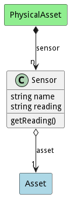

# Sensor

Description 

## Attributes

* name:string - Name of the sensor
* reading:string - This is a catchall of any kind of data coming from a sensor

## Associations

| Name | Cardinality | Class | Composition | Owner | Description |
| --- | --- | --- | --- | --- | --- |
| asset | 1 | Asset | false | false |  |

## Users of the Model

| Name | Cardinality | Class | Composition | Owner | Description |
| --- | --- | --- | --- | --- | --- |
| sensor | n | PhysicalAsset | true | true |  |

## Methods
* [getReading() - Description of the method](#action-getReading)

<h2>Method Details</h2>
    
### Action sensor getReading

* REST - sensor/getReading?attr1=string
* bin - sensor getReading --attr1 string
* js - sensor.getReading({ attr1:string })

#### Description
Description of the method

#### Parameters

| Name | Type | Required | Description |
|---|---|---|---|
| attr1 | string |false | Description for the parameter |

