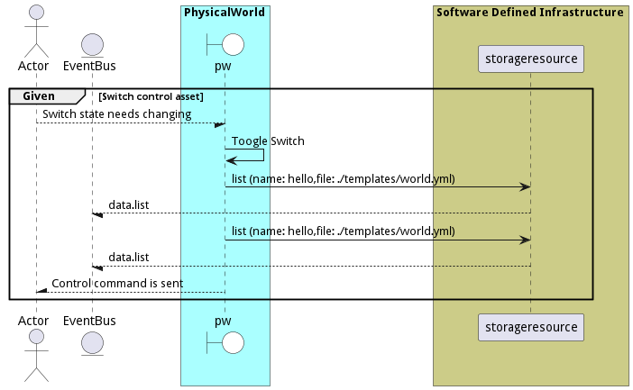

# Change Physical World

Change Physical World is the description

## Actors

* [Actor](actor-actor)

## Detail Scenarios

* [AdjustTemperature](#scenario-AdjustTemperature)
* [toggleSwitch](#scenario-toggleSwitch)

### Scenario Adjust Temperature

Adjust Temperature is the description

#### Criteria

* Given - Tempature control asset
* When - Monitoring system is activated
* Then - Tempature control asset

#### Steps
1. [data list --name hello --file ./templates/world.yml](#action-data-list)
1. [data list --name hello --file ./templates/world.yml](#action-data-list)

#### Actors

* [Actor](actor-actor)

### Scenario Toogle Switch

Turn on-off Switch

#### Criteria

* Given - Switch control asset
* When - Switch state needs changing
* Then - Switch control asset

#### Steps
1. [data list --name hello --file ./templates/world.yml](#action-data-list)
1. [data list --name hello --file ./templates/world.yml](#action-data-list)

#### Actors

* [Actor](actor-actor)

