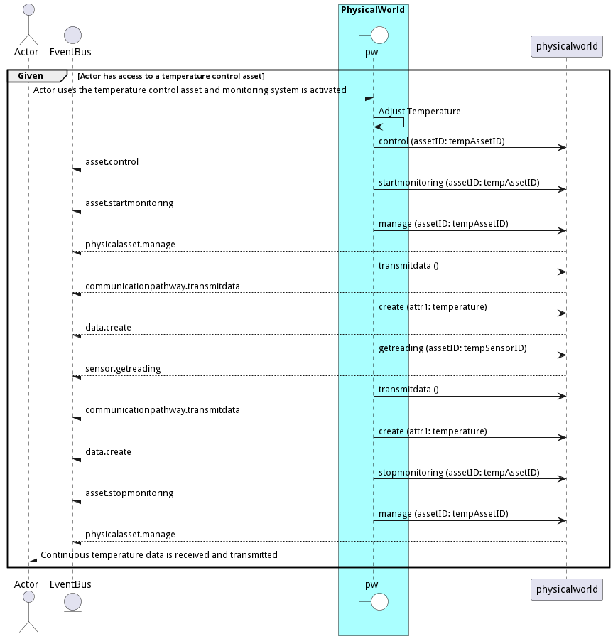

# Change Physical World

Change Physical World is the description

## Actors

* [Actor](actor-actor)

## Detail Scenarios

* [AdjustTemperature](#scenario-AdjustTemperature)
* [toggleSwitch](#scenario-toggleSwitch)

### Scenario Adjust Temperature

The &#34;Adjust Temperature&#34; scenario involves an actor using a temperature control asset, which, when the monitoring system is activated, manages, monitors, and transmits temperature data continuously.

#### Criteria

* Given - Actor has access to a temperature control asset
* When - Actor uses the temperature control asset and monitoring system is activated
* Then - Actor has access to a temperature control asset

#### Steps
1. [ edgemere/cpl/pw/asset/control --assetID tempAssetID](#action--edgemere-cpl-pw-asset-control)
1. [ edgemere/cpl/pw/asset/startmonitoring --assetID tempAssetID](#action--edgemere-cpl-pw-asset-startmonitoring)
1. [ edgemere/cpl/pw/physicalasset/manage --assetID tempAssetID](#action--edgemere-cpl-pw-physicalasset-manage)
1. [ edgemere/cpl/pw/communicationpathway/transmitdata ](#action--edgemere-cpl-pw-communicationpathway-transmitdata)
1. [ edgemere/cpl/pw/data/create --attr1 temperature](#action--edgemere-cpl-pw-data-create)
1. [ edgemere/cpl/pw/sensor/getreading --assetID tempSensorID](#action--edgemere-cpl-pw-sensor-getreading)
1. [ edgemere/cpl/pw/communicationpathway/transmitdata ](#action--edgemere-cpl-pw-communicationpathway-transmitdata)
1. [ edgemere/cpl/pw/data/create --attr1 temperature](#action--edgemere-cpl-pw-data-create)
1. [ edgemere/cpl/pw/asset/stopmonitoring --assetID tempAssetID](#action--edgemere-cpl-pw-asset-stopmonitoring)
1. [ edgemere/cpl/pw/physicalasset/manage --assetID tempAssetID](#action--edgemere-cpl-pw-physicalasset-manage)

#### Actors

* [Actor](actor-actor)

### Scenario Toogle Switch

Turn on-off Switch

#### Criteria

* Given - Switch control asset
* When - Switch state needs changing
* Then - Switch control asset

#### Steps
1. [data list --name hello --file ./templates/world.yml](#action-data-list)
1. [data list --name hello --file ./templates/world.yml](#action-data-list)

#### Actors

* [Actor](actor-actor)

