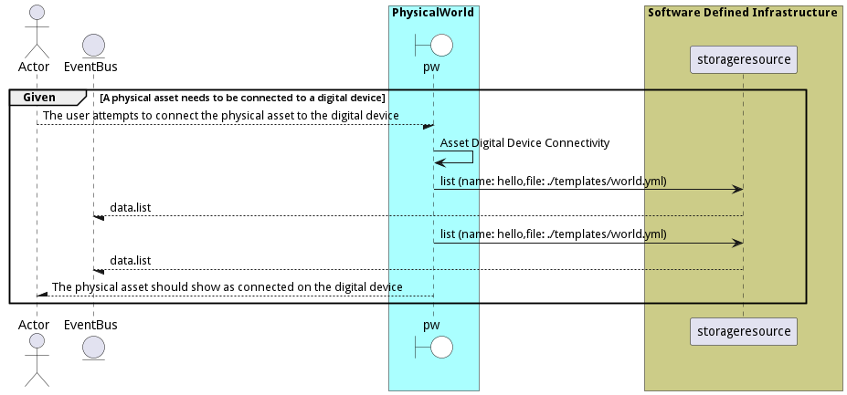

# Connect Physical Asset to a Device

Connect Physical Asset to a Device is the description

## Actors

* [Actor](actor-actor)

## Detail Scenarios

* [AssetDigitalDeviceConnectivity](#scenario-AssetDigitalDeviceConnectivity)

### Scenario Asset Digital Device Connectivity

Asset Digital Device Connectivity is the description

#### Criteria

* Given - A physical asset needs to be connected to a digital device
* When - The user attempts to connect the physical asset to the digital device
* Then - A physical asset needs to be connected to a digital device

#### Steps
1. [data list --name hello --file ./templates/world.yml](#action-data-list)
1. [data list --name hello --file ./templates/world.yml](#action-data-list)

#### Actors

* [Actor](actor-actor)

