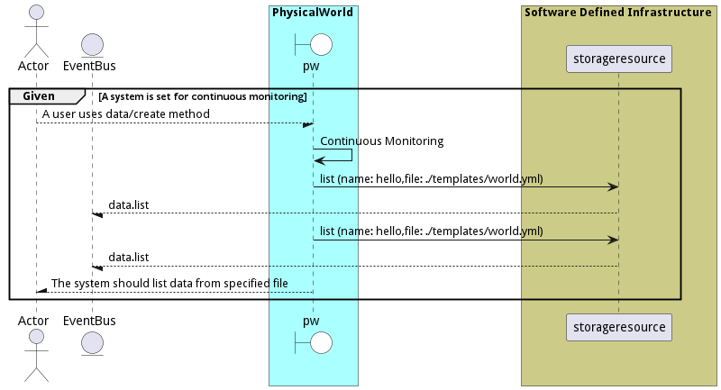

# Monitor Physical World

Monitor Physical World is the description

## Actors

* [Actor](actor-actor)

## Detail Scenarios

* [ContinuousMonitoring](#scenario-ContinuousMonitoring)

### Scenario Continuous Monitoring

Continuous Monitoring is the description

#### Criteria

* Given - A system is set for continuous monitoring
* When - A user uses data/create method
* Then - A system is set for continuous monitoring

#### Steps
1. [data list --name hello --file ./templates/world.yml](#action-data-list)
1. [data list --name hello --file ./templates/world.yml](#action-data-list)

#### Actors

* [Actor](actor-actor)

