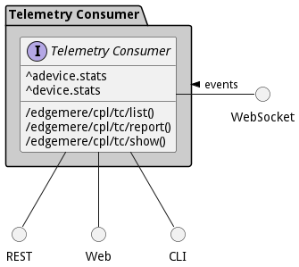
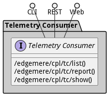

# Telemetry Consumer

Telemetry Consumer is a package that contains...

## Use Cases

The following are the use cases of the Telemetry Consumer subsystem. Each use case has primary and secondary scenarios
that are elaborated in the use case descriptions.

## Users

The following are the actors of the Telemetry Consumer subsystem. This can include people, other subsystems
inside the solution and even external subsystems.

## Interface

The subsystem has a REST, CLI, WebSocket, and Web interface. Use Cases and Scenarios can use any or all
of the interfaces to perform the work that needs to be completed. The following  diagram shows how
users interact with the system.

* [ edgemere cpl tc list](#action--edgemere-cpl-tc-list)
* [ edgemere cpl tc report](#action--edgemere-cpl-tc-report)
* [ edgemere cpl tc show](#action--edgemere-cpl-tc-show)

## Logical Artifacts

The Data Model for the  Telemetry Consumer subsystem shows how the different objects and classes of object interact
and their structure.

### Sub Packages

The Telemetry Consumer subsystem has sub packages as well. These subsystems are logical components to better
organize the architecture and make it easier to analyze, understand, design, and implement.

### Classes

The following are the classes in the data model of the Telemetry Consumer subsystem.

## Deployment Architecture

This subsystem is deployed using micro-services as shown in the diagram below. The 'micro' module is
used to implement the micro-services in the system. The subsystem also has an CLI, REST and Web Interface
exposed through a nodejs application. The nodejs application will interface with the micro-services and
can monitor and drive work-flows through the mesh of micro-services. The deployment of the subsystem is
dependent on the environment it is deployed. This subsystem has the following environments:
* [dev](environment--edgemere-cpl-tc-dev)
* [test](environment--edgemere-cpl-tc-test)
* [prod](environment--edgemere-cpl-tc-prod)

## Physical Architecture

The Telemetry Consumer subsystem is physically laid out on a hybrid cloud infrastructure. Each microservice belongs
to a secure micro-segmented network. All of the micro-services communicate to each other and the main app through a
REST interface. A Command Line Interface (CLI), REST or Web User interface for the app is how other subsystems or actors
interact. Requests are forwarded to micro-services through the REST interface of each micro-service. The subsystem has
the a unique layout based on the environment the physical space. The following are the environments for this
subsystems.
* [dev](environment--edgemere-cpl-tc-dev)
* [test](environment--edgemere-cpl-tc-test)
* [prod](environment--edgemere-cpl-tc-prod)

## Micro-Services

These are the micro-services for the subsystem. The combination of the micro-services help implement
the subsystem's logic.

### dev

Detail information for the [dev environment](environment--edgemere-cpl-tc-dev)
can be found [here](environment--edgemere-cpl-tc-dev)

Services in the dev environment

* consumer : cpl_tc_web:latest
* producer : cpl_tp_producer:latest

### test

Detail information for the [test environment](environment--edgemere-cpl-tc-test)
can be found [here](environment--edgemere-cpl-tc-test)

Services in the test environment

* consumer : cpl_tc_web:latest
* producer : cpl_tp_producer:latest

### prod

Detail information for the [prod environment](environment--edgemere-cpl-tc-prod)
can be found [here](environment--edgemere-cpl-tc-prod)

Services in the prod environment

* consumer : cpl_tc_web:latest
* producer : cpl_tp_producer:latest

## Activities and Flows
The Telemetry Consumer subsystem provides the following activities and flows that help satisfy the use
cases and scenarios of the subsystem.

### Messages Handled

The Telemetry Consumer subsystem is an event driven architecture and handle several events. The following
events are handled by this subsystem. Please note that this subsystem is not the only subsystem that handles
these events.

| Message | Action | Description |
| --- | --- | --- |
| adevice.stats | /tc/report |  |
| device.stats | /ta/report |  |
| device.stats | /tc/report |  |

### Messages Sent

| Event | Description | Emitter |
|-------|-------------|---------|

## Interface Details
The Telemetry Consumer subsystem has a well defined interface. This interface can be accessed using a
command line interface (CLI), REST interface, and Web user interface. This interface is how all other
subsystems and actors can access the system.

### Action  edgemere cpl tc list

* REST - /edgemere/cpl/tc/list?
* bin -  edgemere cpl tc list 
* js - .edgemere.cpl.tc.list({  })

#### Description
report the statstics for a device

#### Parameters

No parameters

### Action  edgemere cpl tc report

* REST - /edgemere/cpl/tc/report?name=string&amp;stats=object
* bin -  edgemere cpl tc report --name string --stats object
* js - .edgemere.cpl.tc.report({ name:string,stats:object })

#### Description
report the statstics for a device

#### Parameters

| Name | Type | Required | Description |
|---|---|---|---|
| name | string |true | The name of the device |
| stats | object |true | The statistics for the device |

### Action  edgemere cpl tc show

* REST - /edgemere/cpl/tc/show?name=object
* bin -  edgemere cpl tc show --name object
* js - .edgemere.cpl.tc.show({ name:object })

#### Description
report the statstics for a device

#### Parameters

| Name | Type | Required | Description |
|---|---|---|---|
| name | object |true | The name of the device |

