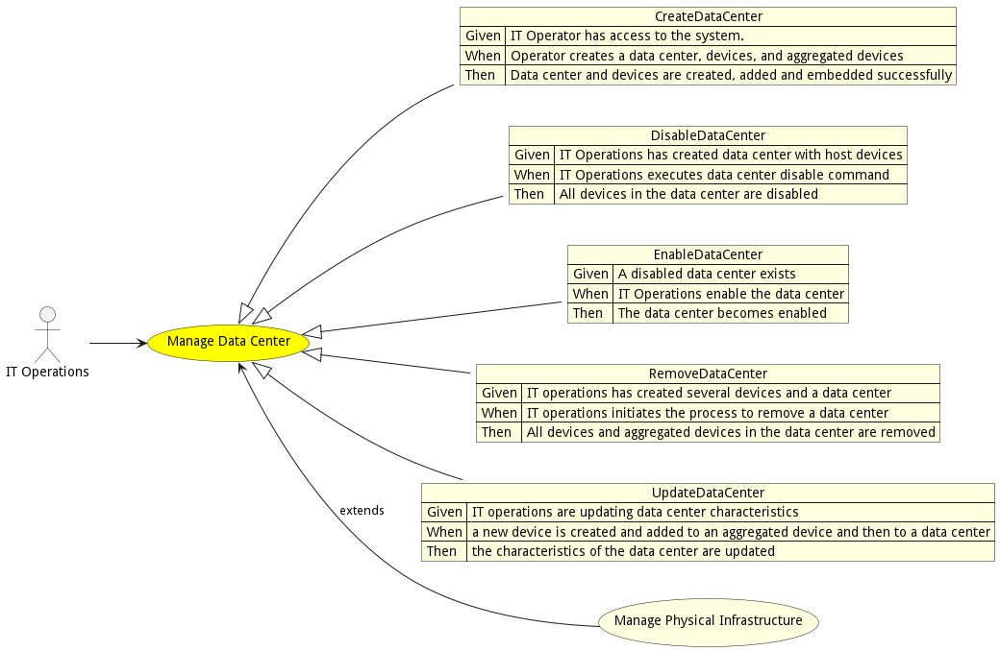
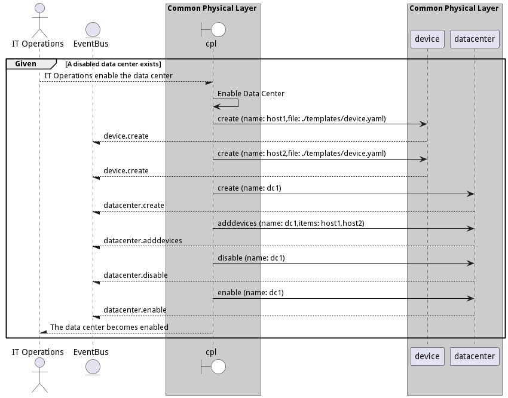
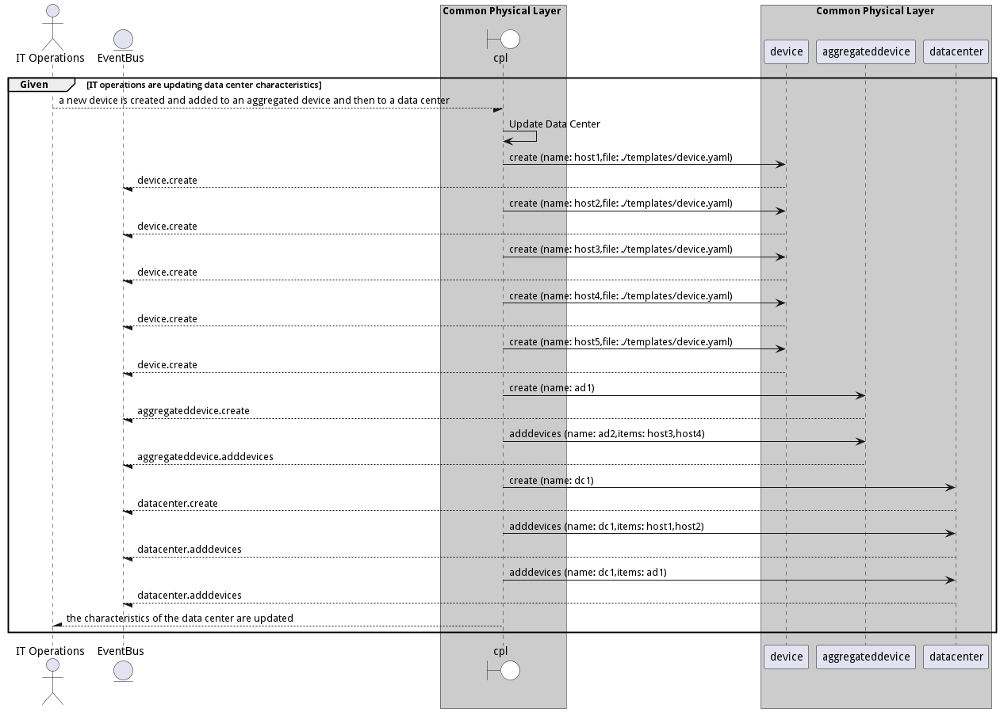

# Manage Data Center

IT Operations manages data centers by creating, deleting, enabling and disabling devicesand aggregated devices

## Actors

* [IT Operations](actor-itops)

## Extends Use Cases

* [Manage Physical Infrastructure](usecase-ManagePhysicalInfrastructure)

## Detail Scenarios

* [CreateDataCenter](#scenario-CreateDataCenter)
* [DisableDataCenter](#scenario-DisableDataCenter)
* [EnableDataCenter](#scenario-EnableDataCenter)
* [RemoveDataCenter](#scenario-RemoveDataCenter)
* [UpdateDataCenter](#scenario-UpdateDataCenter)

### Scenario Create Data Center

IT Operator creates data centers and allows them to add devices and aggregated devices

#### Criteria

* Given - IT Operator has access to the system.
* When - Operator creates a data center, devices, and aggregated devices
* Then - IT Operator has access to the system.

#### Steps
1. [device create --name host1 --file ./templates/device.yaml](#action-device-create)
1. [device create --name host2 --file ./templates/device.yaml](#action-device-create)
1. [device create --name host3 --file ./templates/device.yaml](#action-device-create)
1. [device create --name host4 --file ./templates/device.yaml](#action-device-create)
1. [device create --name host5 --file ./templates/device.yaml](#action-device-create)
1. [aggregateddevice create --name ad1](#action-aggregateddevice-create)
1. [aggregateddevice create --name ad2](#action-aggregateddevice-create)
1. [aggregateddevice adddevices --name ad1 --items host1,host2](#action-aggregateddevice-adddevices)
1. [aggregateddevice adddevices --name ad2 --items host3,host4](#action-aggregateddevice-adddevices)
1. [datacenter create --name dc1](#action-datacenter-create)
1. [datacenter adddevices --name dc1 --items host1,host2](#action-datacenter-adddevices)
1. [datacenter adddevices --name dc1 --items ad2](#action-datacenter-adddevices)
1. [datacenter disable --name dc1](#action-datacenter-disable)
1. [datacenter enable --name dc1](#action-datacenter-enable)

#### Actors

* [IT Operations](actor-itops)

### Scenario Disable Data Center

IT Operations can disable a data center that will disable all of the devices in the data center. This can be used to test business continuity, move data center devices or decomission a data center.

#### Criteria

* Given - IT Operations has created data center with host devices
* When - IT Operations executes data center disable command
* Then - IT Operations has created data center with host devices

#### Steps
1. [device create --name host1 --file ./templates/device.yaml](#action-device-create)
1. [device create --name host2 --file ./templates/device.yaml](#action-device-create)
1. [datacenter create --name dc1](#action-datacenter-create)
1. [datacenter adddevices --name dc1 --items host1,host2](#action-datacenter-adddevices)
1. [datacenter disable --name dc1](#action-datacenter-disable)

#### Actors

* [IT Operations](actor-itops)

### Scenario Enable Data Center

IT Operations can enable a data center that has been disabled

#### Criteria

* Given - A disabled data center exists
* When - IT Operations enable the data center
* Then - A disabled data center exists

#### Steps
1. [device create --name host1 --file ./templates/device.yaml](#action-device-create)
1. [device create --name host2 --file ./templates/device.yaml](#action-device-create)
1. [datacenter create --name dc1](#action-datacenter-create)
1. [datacenter adddevices --name dc1 --items host1,host2](#action-datacenter-adddevices)
1. [datacenter disable --name dc1](#action-datacenter-disable)
1. [datacenter enable --name dc1](#action-datacenter-enable)

#### Actors

* [IT Operations](actor-itops)

### Scenario Remove Data Center

IT Operations can remove a Data Center and all of its devices and aggregated devices

#### Criteria

* Given - IT operations has created several devices and a data center
* When - IT operations initiates the process to remove a data center
* Then - IT operations has created several devices and a data center

#### Steps
1. [device create --name host1 --file ./templates/device.yaml](#action-device-create)
1. [device create --name host2 --file ./templates/device.yaml](#action-device-create)
1. [device create --name host3 --file ./templates/device.yaml](#action-device-create)
1. [device create --name host4 --file ./templates/device.yaml](#action-device-create)
1. [device create --name host5 --file ./templates/device.yaml](#action-device-create)
1. [aggregateddevice create --name ad1](#action-aggregateddevice-create)
1. [aggregateddevice adddevices --name ad2 --items host3,host4](#action-aggregateddevice-adddevices)
1. [datacenter create --name dc1](#action-datacenter-create)
1. [datacenter adddevices --name dc1 --items host1,host2](#action-datacenter-adddevices)
1. [datacenter adddevices --name dc1 --items ad1](#action-datacenter-adddevices)
1. [datacenter destroy --name dc1](#action-datacenter-destroy)

#### Actors

* [IT Operations](actor-itops)

### Scenario Update Data Center

IT Operations updates data center characteristics

#### Criteria

* Given - IT operations are updating data center characteristics
* When - a new device is created and added to an aggregated device and then to a data center
* Then - IT operations are updating data center characteristics

#### Steps
1. [device create --name host1 --file ./templates/device.yaml](#action-device-create)
1. [device create --name host2 --file ./templates/device.yaml](#action-device-create)
1. [device create --name host3 --file ./templates/device.yaml](#action-device-create)
1. [device create --name host4 --file ./templates/device.yaml](#action-device-create)
1. [device create --name host5 --file ./templates/device.yaml](#action-device-create)
1. [aggregateddevice create --name ad1](#action-aggregateddevice-create)
1. [aggregateddevice adddevices --name ad2 --items host3,host4](#action-aggregateddevice-adddevices)
1. [datacenter create --name dc1](#action-datacenter-create)
1. [datacenter adddevices --name dc1 --items host1,host2](#action-datacenter-adddevices)
1. [datacenter adddevices --name dc1 --items ad1](#action-datacenter-adddevices)

#### Actors

* [IT Operations](actor-itops)

