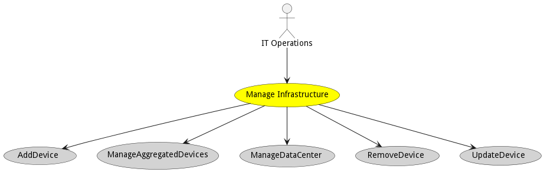
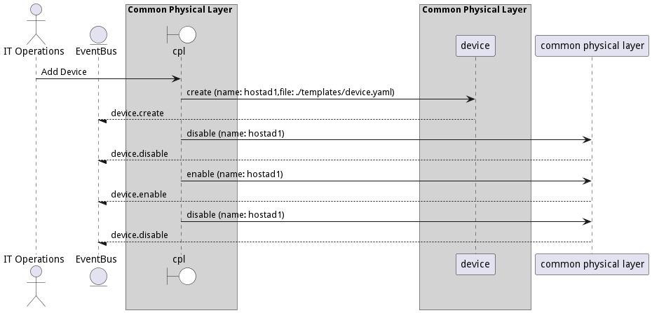
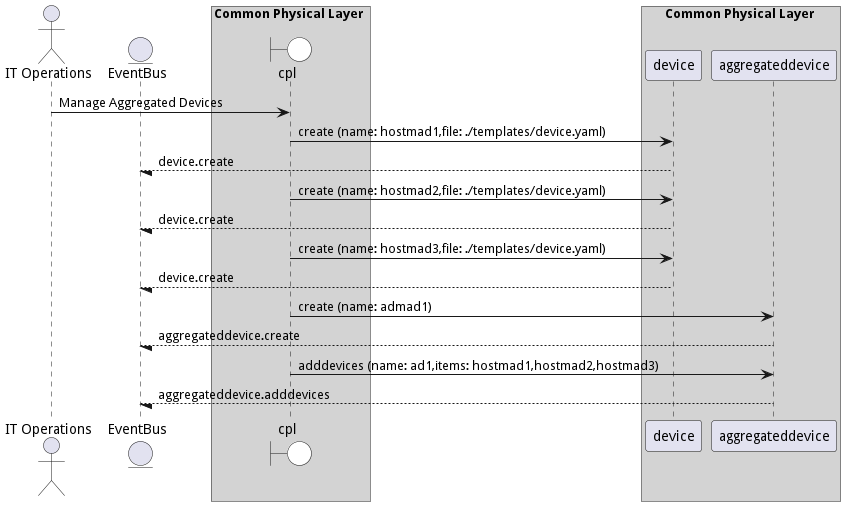

# Manage Infrastructure

Manage Infrastructure is the description

## Actors

* [IT Operations](actor-itops)

## Detail Scenarios

* [Manage Infrastructure](#scenario-AddDevice)
* [Manage Infrastructure](#scenario-ManageAggregatedDevices)
* [Manage Infrastructure](#scenario-ManageDataCenter)
* [Manage Infrastructure](#scenario-RemoveDevice)
* [Manage Infrastructure](#scenario-UpdateDevice)

### Scenario Add Device

Add Device is the description

#### Steps

1. [device create --name hostad1 --file ./templates/device.yaml](#action-device-create)

1. [cpl device/disable --name hostad1](#action-cpl-device-disable)

1. [cpl device/enable --name hostad1](#action-cpl-device-enable)

1. [cpl device/disable --name hostad1](#action-cpl-device-disable)

#### Actors

* [IT Operations](actor-itops)

### Scenario Manage Aggregated Devices

Manage Aggregated Devices is the description

#### Steps

1. [device create --name hostmad1 --file ./templates/device.yaml](#action-device-create)

1. [device create --name hostmad2 --file ./templates/device.yaml](#action-device-create)

1. [device create --name hostmad3 --file ./templates/device.yaml](#action-device-create)

1. [aggregateddevice create --name admad1](#action-aggregateddevice-create)

1. [aggregateddevice adddevices --name ad1 --items hostmad1,hostmad2,hostmad3](#action-aggregateddevice-adddevices)

#### Actors

* [IT Operations](actor-itops)

### Scenario Manage Data Center

Manage Data Center is the description

#### Steps

1. [device create --name hostmdc1 --file ./templates/device.yaml](#action-device-create)

1. [device create --name hostmdc2 --file ./templates/device.yaml](#action-device-create)

1. [device create --name hostmdc3 --file ./templates/device.yaml](#action-device-create)

1. [device create --name hostmdc4 --file ./templates/device.yaml](#action-device-create)

1. [device create --name hostmdc5 --file ./templates/device.yaml](#action-device-create)

1. [aggregateddevice create --name admdc1](#action-aggregateddevice-create)

1. [aggregateddevice create --name admdc2](#action-aggregateddevice-create)

1. [aggregateddevice adddevices --name admdc1 --items hostmdc1,hostmdc2](#action-aggregateddevice-adddevices)

1. [aggregateddevice adddevices --name admdc2 --items hostmdc3,hostmdc4](#action-aggregateddevice-adddevices)

1. [datacenter create --name dcmdc1](#action-datacenter-create)

1. [datacenter adddevices --name dcmdc1 --items hostmdc1,hostmdc2](#action-datacenter-adddevices)

1. [datacenter adddevices --name dcmdc1 --items admdc2](#action-datacenter-adddevices)

1. [datacenter disable --name dcmdc1](#action-datacenter-disable)

1. [datacenter enable --name dcmdc1](#action-datacenter-enable)

#### Actors

* [IT Operations](actor-itops)

### Scenario Remove Device

Remove Device is the description

#### Steps

1. To Be Defined

#### Actors

* [IT Operations](actor-itops)

### Scenario Update Device

Update Device is the description

#### Steps

1. To Be Defined

#### Actors

* [IT Operations](actor-itops)

