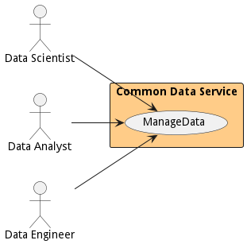
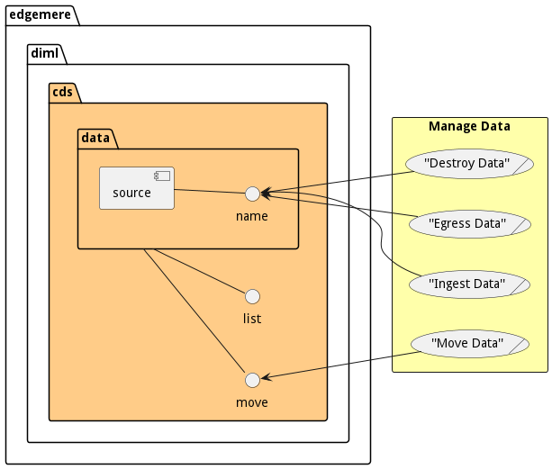
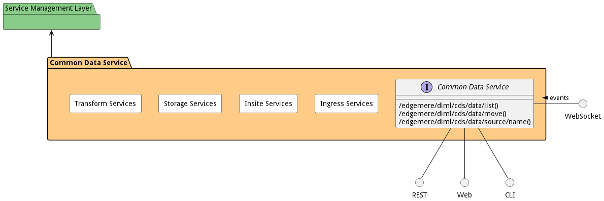
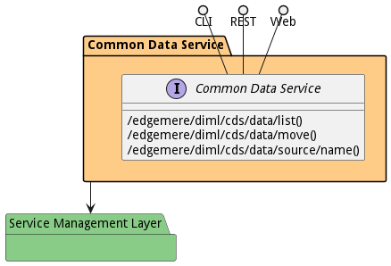

# Common Data Service

Common Data Service is a package that contains...

## Use Cases

The following are the use cases of the Common Data Service subsystem. Each use case has primary and secondary scenarios
that are elaborated in the use case descriptions.

* [Manage Data](usecase-ManageData)

## Users

The following are the actors of the Common Data Service subsystem. This can include people, other subsystems
inside the solution and even external subsystems.

* [DataScientist](actor-datascientist)
* [DataAnalyst](actor-analyst)
* [DataEngineer](actor-dataengineer)

## Interface

The subsystem has a REST, CLI, WebSocket, and Web interface. Use Cases and Scenarios can use any or all
of the interfaces to perform the work that needs to be completed. The following  diagram shows how
users interact with the system.

* [ edgemere diml cds data list](#action--edgemere-diml-cds-data-list)
* [ edgemere diml cds data move](#action--edgemere-diml-cds-data-move)
* [ edgemere diml cds data source name](#action--edgemere-diml-cds-data-source-name)

## Logical Artifacts

The Data Model for the  Common Data Service subsystem shows how the different objects and classes of object interact
and their structure.

### Sub Packages

The Common Data Service subsystem has sub packages as well. These subsystems are logical components to better
organize the architecture and make it easier to analyze, understand, design, and implement.

* [Ingress Services](package--edgemere-diml-cds-ingress)
* [Insite Services](package--edgemere-diml-cds-insite)
* [Storage Services](package--edgemere-diml-cds-storage)
* [Transform Services](package--edgemere-diml-cds-transform)

### Classes

The following are the classes in the data model of the Common Data Service subsystem.

## Deployment Architecture

This subsystem is deployed using micro-services as shown in the diagram below. The 'micro' module is
used to implement the micro-services in the system. The subsystem also has an CLI, REST and Web Interface
exposed through a nodejs application. The nodejs application will interface with the micro-services and
can monitor and drive work-flows through the mesh of micro-services. The deployment of the subsystem is
dependent on the environment it is deployed. This subsystem has the following environments:
* [dev](environment--edgemere-diml-cds-dev)
* [test](environment--edgemere-diml-cds-test)
* [prod](environment--edgemere-diml-cds-prod)

## Physical Architecture

The Common Data Service subsystem is physically laid out on a hybrid cloud infrastructure. Each microservice belongs
to a secure micro-segmented network. All of the micro-services communicate to each other and the main app through a
REST interface. A Command Line Interface (CLI), REST or Web User interface for the app is how other subsystems or actors
interact. Requests are forwarded to micro-services through the REST interface of each micro-service. The subsystem has
the a unique layout based on the environment the physical space. The following are the environments for this
subsystems.
* [dev](environment--edgemere-diml-cds-dev)
* [test](environment--edgemere-diml-cds-test)
* [prod](environment--edgemere-diml-cds-prod)

## Micro-Services

These are the micro-services for the subsystem. The combination of the micro-services help implement
the subsystem's logic.

### dev

Detail information for the [dev environment](environment--edgemere-diml-cds-dev)
can be found [here](environment--edgemere-diml-cds-dev)

Services in the dev environment

* web : diml_cds_web

### test

Detail information for the [test environment](environment--edgemere-diml-cds-test)
can be found [here](environment--edgemere-diml-cds-test)

Services in the test environment

* web : diml_cds_web

### prod

Detail information for the [prod environment](environment--edgemere-diml-cds-prod)
can be found [here](environment--edgemere-diml-cds-prod)

Services in the prod environment

* web : diml_cds_web

## Activities and Flows
The Common Data Service subsystem provides the following activities and flows that help satisfy the use
cases and scenarios of the subsystem.

### Messages Sent

| Event | Description | Emitter |
|-------|-------------|---------|

## Interface Details
The Common Data Service subsystem has a well defined interface. This interface can be accessed using a
command line interface (CLI), REST interface, and Web user interface. This interface is how all other
subsystems and actors can access the system.

### Action  edgemere diml cds data list

* REST - /edgemere/diml/cds/data/list?attr1=string
* bin -  edgemere diml cds data list --attr1 string
* js - .edgemere.diml.cds.data.list({ attr1:string })

#### Description
Description of the action

#### Parameters

| Name | Type | Required | Description |
|---|---|---|---|
| attr1 | string |false | Description for the parameter |

### Action  edgemere diml cds data move

* REST - /edgemere/diml/cds/data/move?attr1=string
* bin -  edgemere diml cds data move --attr1 string
* js - .edgemere.diml.cds.data.move({ attr1:string })

#### Description
Description of the action

#### Parameters

| Name | Type | Required | Description |
|---|---|---|---|
| attr1 | string |false | Description for the parameter |

### Action  edgemere diml cds data source name

* REST - /edgemere/diml/cds/data/source/name?attr1=string
* bin -  edgemere diml cds data source name --attr1 string
* js - .edgemere.diml.cds.data.source.name({ attr1:string })

#### Description
Description of the action

#### Parameters

| Name | Type | Required | Description |
|---|---|---|---|
| attr1 | string |false | Description for the parameter |

