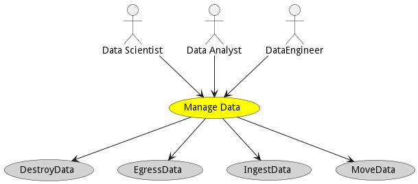

# Manage Data

Manage Data is the description

## Actors

* [Data Scientist](actor-datascientist)
* [Data Analyst](actor-analyst)
* [DataEngineer](actor-dataengineer)

## Detail Scenarios

* [Manage Data](#scenario-DestroyData)
* [Manage Data](#scenario-EgressData)
* [Manage Data](#scenario-IngestData)
* [Manage Data](#scenario-MoveData)

### Scenario Destroy Data

Destroy Data is the description

#### Steps

1. To Be Defined

#### Actors

* [Actor](actor-actor)

### Scenario Egress Data

Egress Data is the description

#### Steps

1. To Be Defined

#### Actors

* [Actor](actor-actor)

### Scenario Ingest Data

Ingest Data is the description

#### Steps

1. To Be Defined

#### Actors

* [Actor](actor-actor)

### Scenario Move Data

Move Data is the description

#### Steps

1. To Be Defined

#### Actors

* [Actor](actor-actor)

