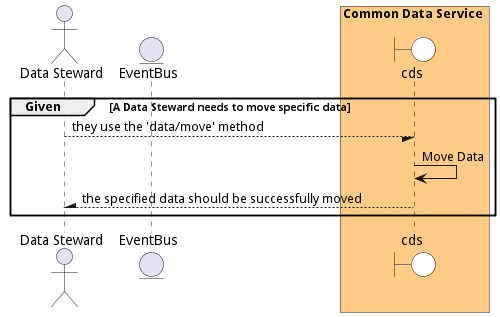

# Manage Data

Manage Data is the description

## Actors

* [Data Scientist](actor-datascientist)
* [Data Analyst](actor-analyst)
* [DataEngineer](actor-dataengineer)

## Detail Scenarios

* [DestroyData](#scenario-DestroyData)
* [EgressData](#scenario-EgressData)
* [IngestData](#scenario-IngestData)
* [MoveData](#scenario-MoveData)

### Scenario Destroy Data

Destroy Data is the description

#### Steps
1. To Be Defined

#### Actors

* [Data Steward](actor-datasteward)

### Scenario Egress Data

Egress Data is the description

#### Steps
1. To Be Defined

#### Actors

* [Data Steward](actor-datasteward)

### Scenario Ingest Data

Ingest Data is the description

#### Steps
1. To Be Defined

#### Actors

* [Data Steward](actor-datasteward)

### Scenario Move Data

Move Data is the description

#### Steps
1. To Be Defined

#### Actors

* [Data Steward](actor-datasteward)

