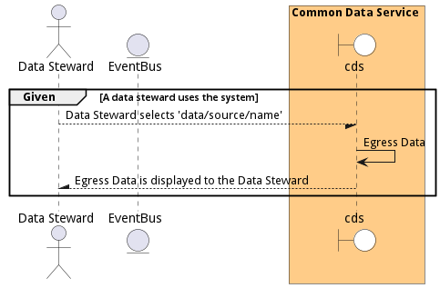
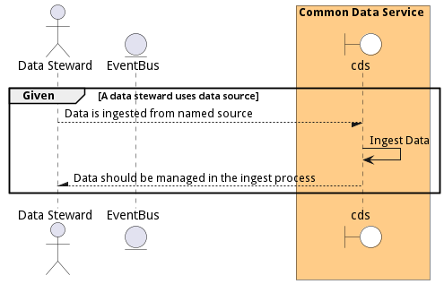

# Manage Data

Manage Data is the description

## Actors

* [Data Scientist](actor-datascientist)
* [Data Analyst](actor-analyst)
* [DataEngineer](actor-dataengineer)

## Extends Use Cases

* [Provide Business Information](usecase-ProvideBusinessInformation)

## Detail Scenarios

* [DestroyData](#scenario-DestroyData)
* [EgressData](#scenario-EgressData)
* [IngestData](#scenario-IngestData)
* [MoveData](#scenario-MoveData)

### Scenario Destroy Data

Destroy Data is the description

#### Criteria

* Given - Data Steward has access to the data source
* When - Data Steward uses method to destroy data
* Then - Data Steward has access to the data source

#### Steps
1. To Be Defined

#### Actors

* [Data Steward](actor-datasteward)

### Scenario Egress Data

Egress Data is the description

#### Criteria

* Given - A data steward uses the system
* When - Data Steward selects &#39;data/source/name&#39;
* Then - A data steward uses the system

#### Steps
1. To Be Defined

#### Actors

* [Data Steward](actor-datasteward)

### Scenario Ingest Data

Ingest Data is the description

#### Criteria

* Given - A data steward uses data source
* When - Data is ingested from named source
* Then - A data steward uses data source

#### Steps
1. To Be Defined

#### Actors

* [Data Steward](actor-datasteward)

### Scenario Move Data

Move Data is the description

#### Criteria

* Given - A Data Steward needs to move specific data
* When - they use the &#39;data/move&#39; method
* Then - A Data Steward needs to move specific data

#### Steps
1. To Be Defined

#### Actors

* [Data Steward](actor-datasteward)

