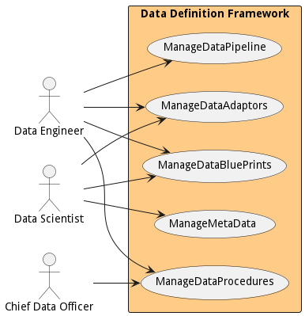
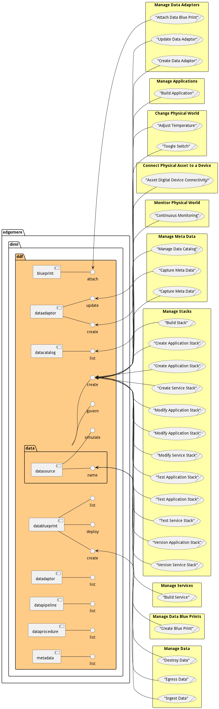
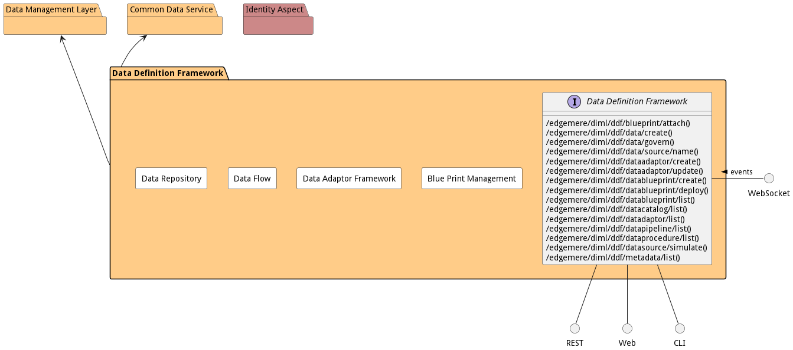

# Data Definition Framework

Data Definition Framework is a package that contains...

## Use Cases

The following are the use cases of the Data Definition Framework subsystem. Each use case has primary and secondary scenarios
that are elaborated in the use case descriptions.

* [Manage Data Adaptors](usecase-ManageDataAdaptors)
* [Manage Data Blue Prints](usecase-ManageDataBluePrints)
* [Manage Data Pipeline](usecase-ManageDataPipeline)
* [Manage Data Procedures](usecase-ManageDataProcedures)
* [Manage Meta Data](usecase-ManageMetaData)

## Users

The following are the actors of the Data Definition Framework subsystem. This can include people, other subsystems
inside the solution and even external subsystems.

* [DataEngineer](actor-dataengineer)
* [DataScientist](actor-datascientist)
* [ChiefDataOfficer](actor-chiefdataofficer)

## Interface

The subsystem has a REST, CLI, WebSocket, and Web interface. Use Cases and Scenarios can use any or all
of the interfaces to perform the work that needs to be completed. The following  diagram shows how
users interact with the system.

* [ edgemere diml ddf blueprint attach](#action--edgemere-diml-ddf-blueprint-attach)
* [ edgemere diml ddf data create](#action--edgemere-diml-ddf-data-create)
* [ edgemere diml ddf data govern](#action--edgemere-diml-ddf-data-govern)
* [ edgemere diml ddf data source name](#action--edgemere-diml-ddf-data-source-name)
* [ edgemere diml ddf dataadaptor create](#action--edgemere-diml-ddf-dataadaptor-create)
* [ edgemere diml ddf dataadaptor update](#action--edgemere-diml-ddf-dataadaptor-update)
* [ edgemere diml ddf datablueprint create](#action--edgemere-diml-ddf-datablueprint-create)
* [ edgemere diml ddf datablueprint deploy](#action--edgemere-diml-ddf-datablueprint-deploy)
* [ edgemere diml ddf datablueprint list](#action--edgemere-diml-ddf-datablueprint-list)
* [ edgemere diml ddf datacatalog list](#action--edgemere-diml-ddf-datacatalog-list)
* [ edgemere diml ddf datadaptor list](#action--edgemere-diml-ddf-datadaptor-list)
* [ edgemere diml ddf datapipeline list](#action--edgemere-diml-ddf-datapipeline-list)
* [ edgemere diml ddf dataprocedure list](#action--edgemere-diml-ddf-dataprocedure-list)
* [ edgemere diml ddf datasource simulate](#action--edgemere-diml-ddf-datasource-simulate)
* [ edgemere diml ddf metadata list](#action--edgemere-diml-ddf-metadata-list)

## Logical Artifacts

The Data Model for the  Data Definition Framework subsystem shows how the different objects and classes of object interact
and their structure.

### Sub Packages

The Data Definition Framework subsystem has sub packages as well. These subsystems are logical components to better
organize the architecture and make it easier to analyze, understand, design, and implement.

* [Blue Print Management](package--edgemere-diml-ddf-bpm)
* [Data Adaptor Framework](package--edgemere-diml-ddf-daf)
* [Data Flow](package--edgemere-diml-ddf-df)
* [Data Repository](package--edgemere-diml-ddf-dr)

### Classes

The following are the classes in the data model of the Data Definition Framework subsystem.

* [DataAdaptor](class-DataAdaptor)
* [DataAdaptorInstance](class-DataAdaptorInstance)
* [DataAdaptorTemplate](class-DataAdaptorTemplate)
* [DataBluePrint](class-DataBluePrint)
* [DataBluePrintInstance](class-DataBluePrintInstance)
* [DataFlow](class-DataFlow)
* [DataFlowInstance](class-DataFlowInstance)
* [DataFlowTemplate](class-DataFlowTemplate)
* [DataPipeline](class-DataPipeline)
* [DataProcedure](class-DataProcedure)
* [DataSource](class-DataSource)

## Deployment Architecture

This subsystem is deployed using micro-services as shown in the diagram below. The 'micro' module is
used to implement the micro-services in the system. The subsystem also has an CLI, REST and Web Interface
exposed through a nodejs application. The nodejs application will interface with the micro-services and
can monitor and drive work-flows through the mesh of micro-services. The deployment of the subsystem is
dependent on the environment it is deployed. This subsystem has the following environments:
* [dev](environment--edgemere-diml-ddf-dev)
* [test](environment--edgemere-diml-ddf-test)
* [prod](environment--edgemere-diml-ddf-prod)

## Physical Architecture

The Data Definition Framework subsystem is physically laid out on a hybrid cloud infrastructure. Each microservice belongs
to a secure micro-segmented network. All of the micro-services communicate to each other and the main app through a
REST interface. A Command Line Interface (CLI), REST or Web User interface for the app is how other subsystems or actors
interact. Requests are forwarded to micro-services through the REST interface of each micro-service. The subsystem has
the a unique layout based on the environment the physical space. The following are the environments for this
subsystems.
* [dev](environment--edgemere-diml-ddf-dev)
* [test](environment--edgemere-diml-ddf-test)
* [prod](environment--edgemere-diml-ddf-prod)

## Micro-Services

These are the micro-services for the subsystem. The combination of the micro-services help implement
the subsystem's logic.

### dev

Detail information for the [dev environment](environment--edgemere-diml-ddf-dev)
can be found [here](environment--edgemere-diml-ddf-dev)

Services in the dev environment

* web : diml_ddf_web

### test

Detail information for the [test environment](environment--edgemere-diml-ddf-test)
can be found [here](environment--edgemere-diml-ddf-test)

Services in the test environment

* web : diml_ddf_web

### prod

Detail information for the [prod environment](environment--edgemere-diml-ddf-prod)
can be found [here](environment--edgemere-diml-ddf-prod)

Services in the prod environment

* web : diml_ddf_web

## Activities and Flows
The Data Definition Framework subsystem provides the following activities and flows that help satisfy the use
cases and scenarios of the subsystem.

### Messages Sent

| Event | Description | Emitter |
|-------|-------------|---------|
| dataadaptor.create |  When an object of type DataAdaptor is created. | DataAdaptor
| dataadaptor.destroy |  When an object of type DataAdaptor is destroyed. | DataAdaptor
| dataadaptor.updated |  When an object of type DataAdaptor has an attribute or association updated. | DataAdaptor
| dataadaptorinstance.create |  When an object of type DataAdaptorInstance is created. | DataAdaptorInstance
| dataadaptorinstance.destroy |  When an object of type DataAdaptorInstance is destroyed. | DataAdaptorInstance
| dataadaptorinstance.updated |  When an object of type DataAdaptorInstance has an attribute or association updated. | DataAdaptorInstance
| dataadaptortemplate.create |  When an object of type DataAdaptorTemplate is created. | DataAdaptorTemplate
| dataadaptortemplate.destroy |  When an object of type DataAdaptorTemplate is destroyed. | DataAdaptorTemplate
| dataadaptortemplate.updated |  When an object of type DataAdaptorTemplate has an attribute or association updated. | DataAdaptorTemplate
| datablueprint.create |  When an object of type DataBluePrint is created. | DataBluePrint
| datablueprint.destroy |  When an object of type DataBluePrint is destroyed. | DataBluePrint
| datablueprint.updated |  When an object of type DataBluePrint has an attribute or association updated. | DataBluePrint
| datablueprintinstance.create |  When an object of type DataBluePrintInstance is created. | DataBluePrintInstance
| datablueprintinstance.destroy |  When an object of type DataBluePrintInstance is destroyed. | DataBluePrintInstance
| datablueprintinstance.updated |  When an object of type DataBluePrintInstance has an attribute or association updated. | DataBluePrintInstance
| dataflow.create |  When an object of type DataFlow is created. | DataFlow
| dataflow.destroy |  When an object of type DataFlow is destroyed. | DataFlow
| dataflow.updated |  When an object of type DataFlow has an attribute or association updated. | DataFlow
| dataflowinstance.create |  When an object of type DataFlowInstance is created. | DataFlowInstance
| dataflowinstance.destroy |  When an object of type DataFlowInstance is destroyed. | DataFlowInstance
| dataflowinstance.updated |  When an object of type DataFlowInstance has an attribute or association updated. | DataFlowInstance
| dataflowtemplate.create |  When an object of type DataFlowTemplate is created. | DataFlowTemplate
| dataflowtemplate.destroy |  When an object of type DataFlowTemplate is destroyed. | DataFlowTemplate
| dataflowtemplate.updated |  When an object of type DataFlowTemplate has an attribute or association updated. | DataFlowTemplate
| datapipeline.create |  When an object of type DataPipeline is created. | DataPipeline
| datapipeline.destroy |  When an object of type DataPipeline is destroyed. | DataPipeline
| datapipeline.updated |  When an object of type DataPipeline has an attribute or association updated. | DataPipeline
| dataprocedure.create |  When an object of type DataProcedure is created. | DataProcedure
| dataprocedure.destroy |  When an object of type DataProcedure is destroyed. | DataProcedure
| dataprocedure.updated |  When an object of type DataProcedure has an attribute or association updated. | DataProcedure
| datasource.create |  When an object of type DataSource is created. | DataSource
| datasource.destroy |  When an object of type DataSource is destroyed. | DataSource
| datasource.updated |  When an object of type DataSource has an attribute or association updated. | DataSource

## Interface Details
The Data Definition Framework subsystem has a well defined interface. This interface can be accessed using a
command line interface (CLI), REST interface, and Web user interface. This interface is how all other
subsystems and actors can access the system.

### Action  edgemere diml ddf blueprint attach

* REST - /edgemere/diml/ddf/blueprint/attach?attr1=string
* bin -  edgemere diml ddf blueprint attach --attr1 string
* js - .edgemere.diml.ddf.blueprint.attach({ attr1:string })

#### Description
Description of the action

#### Parameters

| Name | Type | Required | Description |
|---|---|---|---|
| attr1 | string |false | Description for the parameter |

### Action  edgemere diml ddf data create

* REST - /edgemere/diml/ddf/data/create?attr1=string
* bin -  edgemere diml ddf data create --attr1 string
* js - .edgemere.diml.ddf.data.create({ attr1:string })

#### Description
Description of the action

#### Parameters

| Name | Type | Required | Description |
|---|---|---|---|
| attr1 | string |false | Description for the parameter |

### Action  edgemere diml ddf data govern

* REST - /edgemere/diml/ddf/data/govern?attr1=string
* bin -  edgemere diml ddf data govern --attr1 string
* js - .edgemere.diml.ddf.data.govern({ attr1:string })

#### Description
Description of the action

#### Parameters

| Name | Type | Required | Description |
|---|---|---|---|
| attr1 | string |false | Description for the parameter |

### Action  edgemere diml ddf data source name

* REST - /edgemere/diml/ddf/data/source/name?attr1=string
* bin -  edgemere diml ddf data source name --attr1 string
* js - .edgemere.diml.ddf.data.source.name({ attr1:string })

#### Description
Description of the action

#### Parameters

| Name | Type | Required | Description |
|---|---|---|---|
| attr1 | string |false | Description for the parameter |

### Action  edgemere diml ddf dataadaptor create

* REST - /edgemere/diml/ddf/dataadaptor/create?attr1=string
* bin -  edgemere diml ddf dataadaptor create --attr1 string
* js - .edgemere.diml.ddf.dataadaptor.create({ attr1:string })

#### Description
Description of the action

#### Parameters

| Name | Type | Required | Description |
|---|---|---|---|
| attr1 | string |false | Description for the parameter |

### Action  edgemere diml ddf dataadaptor update

* REST - /edgemere/diml/ddf/dataadaptor/update?attr1=string
* bin -  edgemere diml ddf dataadaptor update --attr1 string
* js - .edgemere.diml.ddf.dataadaptor.update({ attr1:string })

#### Description
Description of the action

#### Parameters

| Name | Type | Required | Description |
|---|---|---|---|
| attr1 | string |false | Description for the parameter |

### Action  edgemere diml ddf datablueprint create

* REST - /edgemere/diml/ddf/datablueprint/create?attr1=string
* bin -  edgemere diml ddf datablueprint create --attr1 string
* js - .edgemere.diml.ddf.datablueprint.create({ attr1:string })

#### Description
Description of the action

#### Parameters

| Name | Type | Required | Description |
|---|---|---|---|
| attr1 | string |false | Description for the parameter |

### Action  edgemere diml ddf datablueprint deploy

* REST - /edgemere/diml/ddf/datablueprint/deploy?name=string&amp;blueprint=string&amp;file=YAML&amp;sources=string
* bin -  edgemere diml ddf datablueprint deploy --name string --blueprint string --file YAML --sources string
* js - .edgemere.diml.ddf.datablueprint.deploy({ name:string,blueprint:string,file:YAML,sources:string })

#### Description
Description of the action

#### Parameters

| Name | Type | Required | Description |
|---|---|---|---|
| name | string |true | Name instance of the blueprint |
| blueprint | string |true | Name of the blueprint |
| file | YAML |false | File of with the parameters for the deployment |
| sources | string |false | Names and values of the sources for the blueprint |

### Action  edgemere diml ddf datablueprint list

* REST - /edgemere/diml/ddf/datablueprint/list?attr1=string
* bin -  edgemere diml ddf datablueprint list --attr1 string
* js - .edgemere.diml.ddf.datablueprint.list({ attr1:string })

#### Description
Description of the action

#### Parameters

| Name | Type | Required | Description |
|---|---|---|---|
| attr1 | string |false | Description for the parameter |

### Action  edgemere diml ddf datacatalog list

* REST - /edgemere/diml/ddf/datacatalog/list?attr1=string
* bin -  edgemere diml ddf datacatalog list --attr1 string
* js - .edgemere.diml.ddf.datacatalog.list({ attr1:string })

#### Description
Description of the action

#### Parameters

| Name | Type | Required | Description |
|---|---|---|---|
| attr1 | string |false | Description for the parameter |

### Action  edgemere diml ddf datadaptor list

* REST - /edgemere/diml/ddf/datadaptor/list?attr1=string
* bin -  edgemere diml ddf datadaptor list --attr1 string
* js - .edgemere.diml.ddf.datadaptor.list({ attr1:string })

#### Description
Description of the action

#### Parameters

| Name | Type | Required | Description |
|---|---|---|---|
| attr1 | string |false | Description for the parameter |

### Action  edgemere diml ddf datapipeline list

* REST - /edgemere/diml/ddf/datapipeline/list?attr1=string
* bin -  edgemere diml ddf datapipeline list --attr1 string
* js - .edgemere.diml.ddf.datapipeline.list({ attr1:string })

#### Description
Description of the action

#### Parameters

| Name | Type | Required | Description |
|---|---|---|---|
| attr1 | string |false | Description for the parameter |

### Action  edgemere diml ddf dataprocedure list

* REST - /edgemere/diml/ddf/dataprocedure/list?attr1=string
* bin -  edgemere diml ddf dataprocedure list --attr1 string
* js - .edgemere.diml.ddf.dataprocedure.list({ attr1:string })

#### Description
Description of the action

#### Parameters

| Name | Type | Required | Description |
|---|---|---|---|
| attr1 | string |false | Description for the parameter |

### Action  edgemere diml ddf datasource simulate

* REST - /edgemere/diml/ddf/datasource/simulate?name=string&amp;file=YAML
* bin -  edgemere diml ddf datasource simulate --name string --file YAML
* js - .edgemere.diml.ddf.datasource.simulate({ name:string,file:YAML })

#### Description
Simulate data in the data source

#### Parameters

| Name | Type | Required | Description |
|---|---|---|---|
| name | string |true | Name of the DataSource to simulate |
| file | YAML |true | file that contains the data to simulate |

### Action  edgemere diml ddf metadata list

* REST - /edgemere/diml/ddf/metadata/list?attr1=string
* bin -  edgemere diml ddf metadata list --attr1 string
* js - .edgemere.diml.ddf.metadata.list({ attr1:string })

#### Description
Description of the action

#### Parameters

| Name | Type | Required | Description |
|---|---|---|---|
| attr1 | string |false | Description for the parameter |

