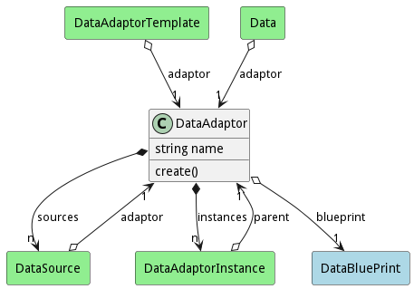

# DataAdaptor

The Data Adaptor is the mechanism that is a proxy to the data in the physical form. For example there is a Data Adaptor for a filesystem, SQL database, or a data stream. Data Adaptors handle the ingestion of the data, management of the data, and access to the data.

## Attributes

* name:string - Name of the adaptor

## Associations

| Name | Cardinality | Class | Composition | Owner | Description |
| --- | --- | --- | --- | --- | --- |
| blueprint | 1 | DataBluePrint | false | false |  |
| sources | n | DataSource | false | true | The Data Sources of the Adapator |
| instances | n | DataAdaptorInstance | false | true | Instance of a DataAdaptor |

## Users of the Model

| Name | Cardinality | Class | Composition | Owner | Description |
| --- | --- | --- | --- | --- | --- |
| parent | 1 | DataAdaptorInstance | false | false |  |
| adaptor | 1 | DataAdaptorTemplate | false | false |  |
| adaptor | 1 | DataSource | false | false |  |
| adaptor | 1 | Data |  |  | This is the DataAdaptor for the Data, it shows how to connect to the data |
| parent | 1 | DataAdaptorInstance | false | false |  |
| adaptor | 1 | DataAdaptorTemplate | false | false |  |
| adaptor | 1 | DataSource | false | false |  |
| adaptor | 1 | Data |  |  | This is the DataAdaptor for the Data, it shows how to connect to the data |
| parent | 1 | DataAdaptorInstance | false | false |  |
| adaptor | 1 | DataAdaptorTemplate | false | false |  |
| adaptor | 1 | DataSource | false | false |  |
| adaptor | 1 | Data |  |  | This is the DataAdaptor for the Data, it shows how to connect to the data |
| parent | 1 | DataAdaptorInstance | false | false |  |
| adaptor | 1 | DataAdaptorTemplate | false | false |  |
| adaptor | 1 | DataSource | false | false |  |
| adaptor | 1 | Data |  |  | This is the DataAdaptor for the Data, it shows how to connect to the data |
| parent | 1 | DataAdaptorInstance | false | false |  |
| adaptor | 1 | DataAdaptorTemplate | false | false |  |
| adaptor | 1 | DataSource | false | false |  |
| adaptor | 1 | Data |  |  | This is the DataAdaptor for the Data, it shows how to connect to the data |
| parent | 1 | DataAdaptorInstance | false | false |  |
| adaptor | 1 | DataAdaptorTemplate | false | false |  |
| adaptor | 1 | DataSource | false | false |  |
| adaptor | 1 | Data |  |  | This is the DataAdaptor for the Data, it shows how to connect to the data |
| parent | 1 | DataAdaptorInstance | false | false |  |
| adaptor | 1 | DataAdaptorTemplate | false | false |  |
| adaptor | 1 | DataSource | false | false |  |
| adaptor | 1 | Data |  |  | This is the DataAdaptor for the Data, it shows how to connect to the data |
| parent | 1 | DataAdaptorInstance | false | false |  |
| adaptor | 1 | DataAdaptorTemplate | false | false |  |
| adaptor | 1 | DataSource | false | false |  |
| adaptor | 1 | Data |  |  | This is the DataAdaptor for the Data, it shows how to connect to the data |
| parent | 1 | DataAdaptorInstance | false | false |  |
| adaptor | 1 | DataAdaptorTemplate | false | false |  |
| adaptor | 1 | DataSource | false | false |  |
| adaptor | 1 | Data |  |  | This is the DataAdaptor for the Data, it shows how to connect to the data |
| parent | 1 | DataAdaptorInstance | false | false |  |
| adaptor | 1 | DataAdaptorTemplate | false | false |  |
| adaptor | 1 | DataSource | false | false |  |
| adaptor | 1 | Data |  |  | This is the DataAdaptor for the Data, it shows how to connect to the data |
| parent | 1 | DataAdaptorInstance | false | false |  |
| adaptor | 1 | DataAdaptorTemplate | false | false |  |
| adaptor | 1 | DataSource | false | false |  |
| adaptor | 1 | Data |  |  | This is the DataAdaptor for the Data, it shows how to connect to the data |
| parent | 1 | DataAdaptorInstance | false | false |  |
| adaptor | 1 | DataAdaptorTemplate | false | false |  |
| adaptor | 1 | DataSource | false | false |  |
| adaptor | 1 | Data |  |  | This is the DataAdaptor for the Data, it shows how to connect to the data |
| parent | 1 | DataAdaptorInstance | false | false |  |
| adaptor | 1 | DataAdaptorTemplate | false | false |  |
| adaptor | 1 | DataSource | false | false |  |
| adaptor | 1 | Data |  |  | This is the DataAdaptor for the Data, it shows how to connect to the data |
| parent | 1 | DataAdaptorInstance | false | false |  |
| adaptor | 1 | DataAdaptorTemplate | false | false |  |
| adaptor | 1 | DataSource | false | false |  |
| adaptor | 1 | Data |  |  | This is the DataAdaptor for the Data, it shows how to connect to the data |
| parent | 1 | DataAdaptorInstance | false | false |  |
| adaptor | 1 | DataAdaptorTemplate | false | false |  |
| adaptor | 1 | DataSource | false | false |  |
| adaptor | 1 | Data |  |  | This is the DataAdaptor for the Data, it shows how to connect to the data |
| parent | 1 | DataAdaptorInstance | false | false |  |
| adaptor | 1 | DataAdaptorTemplate | false | false |  |
| adaptor | 1 | DataSource | false | false |  |
| adaptor | 1 | Data |  |  | This is the DataAdaptor for the Data, it shows how to connect to the data |
| parent | 1 | DataAdaptorInstance | false | false |  |
| adaptor | 1 | DataAdaptorTemplate | false | false |  |
| adaptor | 1 | DataSource | false | false |  |
| adaptor | 1 | Data |  |  | This is the DataAdaptor for the Data, it shows how to connect to the data |
| parent | 1 | DataAdaptorInstance | false | false |  |
| adaptor | 1 | DataAdaptorTemplate | false | false |  |
| adaptor | 1 | DataSource | false | false |  |
| adaptor | 1 | Data |  |  | This is the DataAdaptor for the Data, it shows how to connect to the data |
| parent | 1 | DataAdaptorInstance | false | false |  |
| adaptor | 1 | DataAdaptorTemplate | false | false |  |
| adaptor | 1 | DataSource | false | false |  |
| adaptor | 1 | Data |  |  | This is the DataAdaptor for the Data, it shows how to connect to the data |
| parent | 1 | DataAdaptorInstance | false | false |  |
| adaptor | 1 | DataAdaptorTemplate | false | false |  |
| adaptor | 1 | DataSource | false | false |  |
| adaptor | 1 | Data |  |  | This is the DataAdaptor for the Data, it shows how to connect to the data |
| parent | 1 | DataAdaptorInstance | false | false |  |
| adaptor | 1 | DataAdaptorTemplate | false | false |  |
| adaptor | 1 | DataSource | false | false |  |
| adaptor | 1 | Data |  |  | This is the DataAdaptor for the Data, it shows how to connect to the data |
| parent | 1 | DataAdaptorInstance | false | false |  |
| adaptor | 1 | DataAdaptorTemplate | false | false |  |
| adaptor | 1 | DataSource | false | false |  |
| adaptor | 1 | Data |  |  | This is the DataAdaptor for the Data, it shows how to connect to the data |
| parent | 1 | DataAdaptorInstance | false | false |  |
| adaptor | 1 | DataAdaptorTemplate | false | false |  |
| adaptor | 1 | DataSource | false | false |  |
| adaptor | 1 | Data |  |  | This is the DataAdaptor for the Data, it shows how to connect to the data |
| parent | 1 | DataAdaptorInstance | false | false |  |
| adaptor | 1 | DataAdaptorTemplate | false | false |  |
| adaptor | 1 | DataSource | false | false |  |
| adaptor | 1 | Data |  |  | This is the DataAdaptor for the Data, it shows how to connect to the data |
| parent | 1 | DataAdaptorInstance | false | false |  |
| adaptor | 1 | DataAdaptorTemplate | false | false |  |
| adaptor | 1 | DataSource | false | false |  |
| adaptor | 1 | Data |  |  | This is the DataAdaptor for the Data, it shows how to connect to the data |
| parent | 1 | DataAdaptorInstance | false | false |  |
| adaptor | 1 | DataAdaptorTemplate | false | false |  |
| adaptor | 1 | DataSource | false | false |  |
| adaptor | 1 | Data |  |  | This is the DataAdaptor for the Data, it shows how to connect to the data |
| parent | 1 | DataAdaptorInstance | false | false |  |
| adaptor | 1 | DataAdaptorTemplate | false | false |  |
| adaptor | 1 | DataSource | false | false |  |
| adaptor | 1 | Data |  |  | This is the DataAdaptor for the Data, it shows how to connect to the data |
| parent | 1 | DataAdaptorInstance | false | false |  |
| adaptor | 1 | DataAdaptorTemplate | false | false |  |
| adaptor | 1 | DataSource | false | false |  |
| adaptor | 1 | Data |  |  | This is the DataAdaptor for the Data, it shows how to connect to the data |
| parent | 1 | DataAdaptorInstance | false | false |  |
| adaptor | 1 | DataAdaptorTemplate | false | false |  |
| adaptor | 1 | DataSource | false | false |  |
| adaptor | 1 | Data |  |  | This is the DataAdaptor for the Data, it shows how to connect to the data |
| parent | 1 | DataAdaptorInstance | false | false |  |
| adaptor | 1 | DataAdaptorTemplate | false | false |  |
| adaptor | 1 | DataSource | false | false |  |
| adaptor | 1 | Data |  |  | This is the DataAdaptor for the Data, it shows how to connect to the data |
| parent | 1 | DataAdaptorInstance | false | false |  |
| adaptor | 1 | DataAdaptorTemplate | false | false |  |
| adaptor | 1 | DataSource | false | false |  |
| adaptor | 1 | Data |  |  | This is the DataAdaptor for the Data, it shows how to connect to the data |
| parent | 1 | DataAdaptorInstance | false | false |  |
| adaptor | 1 | DataAdaptorTemplate | false | false |  |
| adaptor | 1 | DataSource | false | false |  |
| adaptor | 1 | Data |  |  | This is the DataAdaptor for the Data, it shows how to connect to the data |
| parent | 1 | DataAdaptorInstance | false | false |  |
| adaptor | 1 | DataAdaptorTemplate | false | false |  |
| adaptor | 1 | DataSource | false | false |  |
| adaptor | 1 | Data |  |  | This is the DataAdaptor for the Data, it shows how to connect to the data |
| parent | 1 | DataAdaptorInstance | false | false |  |
| adaptor | 1 | DataAdaptorTemplate | false | false |  |
| adaptor | 1 | DataSource | false | false |  |
| adaptor | 1 | Data |  |  | This is the DataAdaptor for the Data, it shows how to connect to the data |
| parent | 1 | DataAdaptorInstance | false | false |  |
| adaptor | 1 | DataAdaptorTemplate | false | false |  |
| adaptor | 1 | DataSource | false | false |  |
| adaptor | 1 | Data |  |  | This is the DataAdaptor for the Data, it shows how to connect to the data |
| parent | 1 | DataAdaptorInstance | false | false |  |
| adaptor | 1 | DataAdaptorTemplate | false | false |  |
| adaptor | 1 | DataSource | false | false |  |
| adaptor | 1 | Data |  |  | This is the DataAdaptor for the Data, it shows how to connect to the data |
| parent | 1 | DataAdaptorInstance | false | false |  |
| adaptor | 1 | DataAdaptorTemplate | false | false |  |
| adaptor | 1 | DataSource | false | false |  |
| adaptor | 1 | Data |  |  | This is the DataAdaptor for the Data, it shows how to connect to the data |
| parent | 1 | DataAdaptorInstance | false | false |  |
| adaptor | 1 | DataAdaptorTemplate | false | false |  |
| adaptor | 1 | DataSource | false | false |  |
| adaptor | 1 | Data |  |  | This is the DataAdaptor for the Data, it shows how to connect to the data |
| parent | 1 | DataAdaptorInstance | false | false |  |
| adaptor | 1 | DataAdaptorTemplate | false | false |  |
| adaptor | 1 | DataSource | false | false |  |
| adaptor | 1 | Data |  |  | This is the DataAdaptor for the Data, it shows how to connect to the data |
| parent | 1 | DataAdaptorInstance | false | false |  |
| adaptor | 1 | DataAdaptorTemplate | false | false |  |
| adaptor | 1 | DataSource | false | false |  |
| adaptor | 1 | Data |  |  | This is the DataAdaptor for the Data, it shows how to connect to the data |
| parent | 1 | DataAdaptorInstance | false | false |  |
| adaptor | 1 | DataAdaptorTemplate | false | false |  |
| adaptor | 1 | DataSource | false | false |  |
| adaptor | 1 | Data |  |  | This is the DataAdaptor for the Data, it shows how to connect to the data |
| parent | 1 | DataAdaptorInstance | false | false |  |
| adaptor | 1 | DataAdaptorTemplate | false | false |  |
| adaptor | 1 | DataSource | false | false |  |
| adaptor | 1 | Data |  |  | This is the DataAdaptor for the Data, it shows how to connect to the data |
| parent | 1 | DataAdaptorInstance | false | false |  |
| adaptor | 1 | DataAdaptorTemplate | false | false |  |
| adaptor | 1 | DataSource | false | false |  |
| adaptor | 1 | Data |  |  | This is the DataAdaptor for the Data, it shows how to connect to the data |
| parent | 1 | DataAdaptorInstance | false | false |  |
| adaptor | 1 | DataAdaptorTemplate | false | false |  |
| adaptor | 1 | DataSource | false | false |  |
| adaptor | 1 | Data |  |  | This is the DataAdaptor for the Data, it shows how to connect to the data |

## Methods

* [create() - Create a Data Adaptor](#action-create)

<h2>Method Details</h2>
    
### Action dataadaptor create

* REST - dataadaptor/create
* bin - dataadaptor create
* js - dataadaptor.create

Create a Data Adaptor

| Name | Type | Required | Description |
|---|---|---|---|
| name | string |true | name of the data adaptor |
| file | YAML |false | file with the definition |

