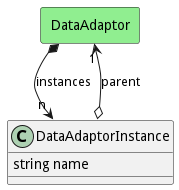

# DataAdaptorInstance

Description long description

## Attributes

* name:string - Name of the DataAdaptorInstance

## Associations

| Name | Cardinality | Class | Composition | Owner | Description |
| --- | --- | --- | --- | --- | --- |
| parent | 1 | DataAdaptor | false | false |  |

## Users of the Model

| Name | Cardinality | Class | Composition | Owner | Description |
| --- | --- | --- | --- | --- | --- |
| instances | n | DataAdaptor | false | true | Instance of a DataAdaptor |

## Methods

<h2>Method Details</h2>
    

