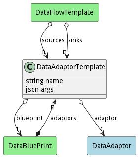

# DataAdaptorTemplate

Data Adaptor with the arguments waiting to be filled out. This allows for the late binding of the data adaptor in the blue print.

## Attributes

* name:string - Name of the Data Adaptor template in the blueprint
* args:json - Arguments for the data adaptor instantiation.

## Associations

| Name | Cardinality | Class | Composition | Owner | Description |
| --- | --- | --- | --- | --- | --- |
| adaptor | 1 | DataAdaptor | false | false |  |
| blueprint | 1 | DataBluePrint | false | false |  |

## Users of the Model

| Name | Cardinality | Class | Composition | Owner | Description |
| --- | --- | --- | --- | --- | --- |
| adaptors | n | DataBluePrint | false | true |  |
| sources | n | DataFlowTemplate | false | false |  |
| sinks | n | DataFlowTemplate | false | false |  |
| adaptors | n | DataBluePrint | false | true |  |
| sources | n | DataFlowTemplate | false | false |  |
| sinks | n | DataFlowTemplate | false | false |  |
| adaptors | n | DataBluePrint | false | true |  |
| sources | n | DataFlowTemplate | false | false |  |
| sinks | n | DataFlowTemplate | false | false |  |
| adaptors | n | DataBluePrint | false | true |  |
| sources | n | DataFlowTemplate | false | false |  |
| sinks | n | DataFlowTemplate | false | false |  |
| adaptors | n | DataBluePrint | false | true |  |
| sources | n | DataFlowTemplate | false | false |  |
| sinks | n | DataFlowTemplate | false | false |  |
| adaptors | n | DataBluePrint | false | true |  |
| sources | n | DataFlowTemplate | false | false |  |
| sinks | n | DataFlowTemplate | false | false |  |
| adaptors | n | DataBluePrint | false | true |  |
| sources | n | DataFlowTemplate | false | false |  |
| sinks | n | DataFlowTemplate | false | false |  |
| adaptors | n | DataBluePrint | false | true |  |
| sources | n | DataFlowTemplate | false | false |  |
| sinks | n | DataFlowTemplate | false | false |  |
| adaptors | n | DataBluePrint | false | true |  |
| sources | n | DataFlowTemplate | false | false |  |
| sinks | n | DataFlowTemplate | false | false |  |
| adaptors | n | DataBluePrint | false | true |  |
| sources | n | DataFlowTemplate | false | false |  |
| sinks | n | DataFlowTemplate | false | false |  |
| adaptors | n | DataBluePrint | false | true |  |
| sources | n | DataFlowTemplate | false | false |  |
| sinks | n | DataFlowTemplate | false | false |  |
| adaptors | n | DataBluePrint | false | true |  |
| sources | n | DataFlowTemplate | false | false |  |
| sinks | n | DataFlowTemplate | false | false |  |
| adaptors | n | DataBluePrint | false | true |  |
| sources | n | DataFlowTemplate | false | false |  |
| sinks | n | DataFlowTemplate | false | false |  |
| adaptors | n | DataBluePrint | false | true |  |
| sources | n | DataFlowTemplate | false | false |  |
| sinks | n | DataFlowTemplate | false | false |  |
| adaptors | n | DataBluePrint | false | true |  |
| sources | n | DataFlowTemplate | false | false |  |
| sinks | n | DataFlowTemplate | false | false |  |
| adaptors | n | DataBluePrint | false | true |  |
| sources | n | DataFlowTemplate | false | false |  |
| sinks | n | DataFlowTemplate | false | false |  |
| adaptors | n | DataBluePrint | false | true |  |
| sources | n | DataFlowTemplate | false | false |  |
| sinks | n | DataFlowTemplate | false | false |  |
| adaptors | n | DataBluePrint | false | true |  |
| sources | n | DataFlowTemplate | false | false |  |
| sinks | n | DataFlowTemplate | false | false |  |
| adaptors | n | DataBluePrint | false | true |  |
| sources | n | DataFlowTemplate | false | false |  |
| sinks | n | DataFlowTemplate | false | false |  |
| adaptors | n | DataBluePrint | false | true |  |
| sources | n | DataFlowTemplate | false | false |  |
| sinks | n | DataFlowTemplate | false | false |  |
| adaptors | n | DataBluePrint | false | true |  |
| sources | n | DataFlowTemplate | false | false |  |
| sinks | n | DataFlowTemplate | false | false |  |
| adaptors | n | DataBluePrint | false | true |  |
| sources | n | DataFlowTemplate | false | false |  |
| sinks | n | DataFlowTemplate | false | false |  |
| adaptors | n | DataBluePrint | false | true |  |
| sources | n | DataFlowTemplate | false | false |  |
| sinks | n | DataFlowTemplate | false | false |  |
| adaptors | n | DataBluePrint | false | true |  |
| sources | n | DataFlowTemplate | false | false |  |
| sinks | n | DataFlowTemplate | false | false |  |
| adaptors | n | DataBluePrint | false | true |  |
| sources | n | DataFlowTemplate | false | false |  |
| sinks | n | DataFlowTemplate | false | false |  |
| adaptors | n | DataBluePrint | false | true |  |
| sources | n | DataFlowTemplate | false | false |  |
| sinks | n | DataFlowTemplate | false | false |  |
| adaptors | n | DataBluePrint | false | true |  |
| sources | n | DataFlowTemplate | false | false |  |
| sinks | n | DataFlowTemplate | false | false |  |
| adaptors | n | DataBluePrint | false | true |  |
| sources | n | DataFlowTemplate | false | false |  |
| sinks | n | DataFlowTemplate | false | false |  |
| adaptors | n | DataBluePrint | false | true |  |
| sources | n | DataFlowTemplate | false | false |  |
| sinks | n | DataFlowTemplate | false | false |  |
| adaptors | n | DataBluePrint | false | true |  |
| sources | n | DataFlowTemplate | false | false |  |
| sinks | n | DataFlowTemplate | false | false |  |
| adaptors | n | DataBluePrint | false | true |  |
| sources | n | DataFlowTemplate | false | false |  |
| sinks | n | DataFlowTemplate | false | false |  |
| adaptors | n | DataBluePrint | false | true |  |
| sources | n | DataFlowTemplate | false | false |  |
| sinks | n | DataFlowTemplate | false | false |  |
| adaptors | n | DataBluePrint | false | true |  |
| sources | n | DataFlowTemplate | false | false |  |
| sinks | n | DataFlowTemplate | false | false |  |
| adaptors | n | DataBluePrint | false | true |  |
| sources | n | DataFlowTemplate | false | false |  |
| sinks | n | DataFlowTemplate | false | false |  |
| adaptors | n | DataBluePrint | false | true |  |
| sources | n | DataFlowTemplate | false | false |  |
| sinks | n | DataFlowTemplate | false | false |  |
| adaptors | n | DataBluePrint | false | true |  |
| sources | n | DataFlowTemplate | false | false |  |
| sinks | n | DataFlowTemplate | false | false |  |
| adaptors | n | DataBluePrint | false | true |  |
| sources | n | DataFlowTemplate | false | false |  |
| sinks | n | DataFlowTemplate | false | false |  |
| adaptors | n | DataBluePrint | false | true |  |
| sources | n | DataFlowTemplate | false | false |  |
| sinks | n | DataFlowTemplate | false | false |  |
| adaptors | n | DataBluePrint | false | true |  |
| sources | n | DataFlowTemplate | false | false |  |
| sinks | n | DataFlowTemplate | false | false |  |
| adaptors | n | DataBluePrint | false | true |  |
| sources | n | DataFlowTemplate | false | false |  |
| sinks | n | DataFlowTemplate | false | false |  |
| adaptors | n | DataBluePrint | false | true |  |
| sources | n | DataFlowTemplate | false | false |  |
| sinks | n | DataFlowTemplate | false | false |  |
| adaptors | n | DataBluePrint | false | true |  |
| sources | n | DataFlowTemplate | false | false |  |
| sinks | n | DataFlowTemplate | false | false |  |
| adaptors | n | DataBluePrint | false | true |  |
| sources | n | DataFlowTemplate | false | false |  |
| sinks | n | DataFlowTemplate | false | false |  |
| adaptors | n | DataBluePrint | false | true |  |
| sources | n | DataFlowTemplate | false | false |  |
| sinks | n | DataFlowTemplate | false | false |  |

## Methods

<h2>Method Details</h2>
    

