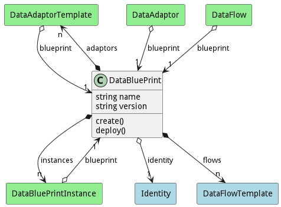

# DataBluePrint

Data Blue Print allows a Data Scientist to describe how to manage data

## Attributes

* name:string - name of the data blue print
* version:string - name of the data blue print

## Associations

| Name | Cardinality | Class | Composition | Owner | Description |
| --- | --- | --- | --- | --- | --- |
| adaptors | n | DataAdaptorTemplate | false | true |  |
| identity | 1 | Identity | false | false |  |
| flows | n | DataFlowTemplate | false | true |  |
| instances | n | DataBluePrintInstance | false | true |  |

## Users of the Model

| Name | Cardinality | Class | Composition | Owner | Description |
| --- | --- | --- | --- | --- | --- |
| blueprint | 1 | DataAdaptor | false | false |  |
| blueprint | 1 | DataAdaptorTemplate | false | false |  |
| blueprint | 1 | DataBluePrintInstance | false | false |  |
| blueprint | 1 | DataFlow | false | false |  |

## Methods
* [create() - Create a Data Blue Print](#action-create)
* [deploy() - Deploy a Data Blue Print with sources](#action-deploy)

<h2>Method Details</h2>
    
### Action datablueprint create

* REST - datablueprint/create?name=string&amp;file=YAML
* bin - datablueprint create --name string --file YAML
* js - datablueprint.create({ name:string,file:YAML })

#### Description
Create a Data Blue Print

#### Parameters

| Name | Type | Required | Description |
|---|---|---|---|
| name | string |true | name of the data blue print |
| file | YAML |false | file with the definition |

### Action datablueprint deploy

* REST - datablueprint/deploy?name=string&amp;file=YAML&amp;sources=string
* bin - datablueprint deploy --name string --file YAML --sources string
* js - datablueprint.deploy({ name:string,file:YAML,sources:string })

#### Description
Deploy a Data Blue Print with sources

#### Parameters

| Name | Type | Required | Description |
|---|---|---|---|
| name | string |true | name of the data blue print |
| file | YAML |false | file with the definition |
| sources | string |false | sources for the blueprint |

