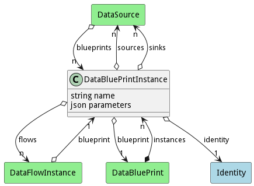

# DataBluePrintInstance

Instance of a Data Blue Print running in the system

## Attributes

* name:string - Name of the Blue Print Instance
* parameters:json - Parameters passed into the Instance of the Blue Print

## Associations

| Name | Cardinality | Class | Composition | Owner | Description |
| --- | --- | --- | --- | --- | --- |
| sources | n | DataSource | false | false |  |
| sinks | n | DataSource | false | false |  |
| flows | n | DataFlowInstance | false | false |  |
| identity | 1 | Identity | false | false |  |
| blueprint | 1 | DataBluePrint | false | false |  |

## Users of the Model

| Name | Cardinality | Class | Composition | Owner | Description |
| --- | --- | --- | --- | --- | --- |
| instances | n | DataBluePrint | false | true |  |
| blueprint | 1 | DataFlowInstance | false | false |  |
| blueprints | n | DataSource | false | false |  |

## Methods

<h2>Method Details</h2>
    

