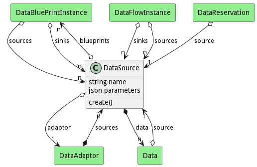
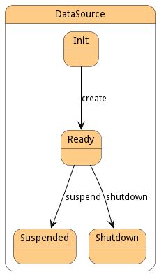

# DataSource

DataSource represents a source of data. This could be a database, filesystem, stream of data etc..  It is an instance of a DataAdaptor. Where the DataAdapator allows for a class of data source. The DataSource takes the values of the DataAdaptor and makes them real for example, a filesystem adaptor needs a host and a root directory in order to know how to connect to it.

## Attributes

* name:string - Name of the Data Source
* parameters:json - Parameters for the DataSource

## Associations

| Name | Cardinality | Class | Composition | Owner | Description |
| --- | --- | --- | --- | --- | --- |
| blueprints | n | DataBluePrintInstance | false | false |  |
| adaptor | 1 | DataAdaptor | false | false |  |
| data | n | Data | true | true |  |

## Users of the Model

| Name | Cardinality | Class | Composition | Owner | Description |
| --- | --- | --- | --- | --- | --- |
| sources | n | DataAdaptor | false | true | The Data Sources of the Adapator |
| sources | n | DataBluePrintInstance | false | false |  |
| sinks | n | DataBluePrintInstance | false | false |  |
| sinks | n | DataFlowInstance | false | false |  |
| sources | n | DataFlowInstance | false | false |  |
| source | 1 | DataReservation | false | false |  |
| source | 1 | Data |  |  | This is the DataSource that owns the data |

## State Net
The DataSource has a state net corresponding to instances of the class. Each state transistion will emit an 
event that can be caught with a websocket client. The name of the event is the name of the state in all lower case.
The following diagram is the state net for this class.

| Name | Description | Events |
| --- | --- | --- |
| Init | Initial State | create-&gt;Ready,  |
| Ready | Data Source Ready to be used | suspend-&gt;Suspended, shutdown-&gt;Shutdown,  |
| Suspended |  |  |
| Shutdown |  |  |

## Methods

* [create() - Create a Data Source](#action-create)

<h2>Method Details</h2>
    
### Action datasource create

* REST - datasource/create?name=string&amp;adaptor=ref&amp;file=YAML&amp;parameters=string
* bin - datasource create --name string --adaptor ref --file YAML --parameters string
* js - datasource.create({ name:string,adaptor:ref,file:YAML,parameters:string })

#### Description
Create a Data Source

#### Parameters

| Name | Type | Required | Description |
|---|---|---|---|
| name | string |true | name of the data source |
| adaptor | ref |true | Adaptor for the data source |
| file | YAML |false | file with the definition |
| parameters | string |false | parameters comma separated name=value,vname2=value2 |

