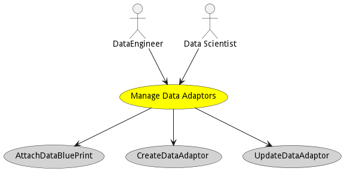
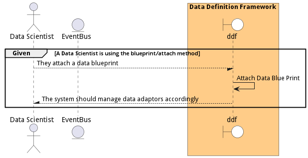
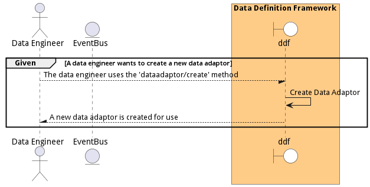
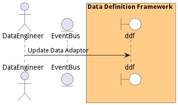

# Manage Data Adaptors

Manage Data Adaptors is the description

## Actors

* [DataEngineer](actor-dataengineer)
* [Data Scientist](actor-datascientist)

## Extends Use Cases

* [Provide Business Information](usecase-ProvideBusinessInformation)

## Detail Scenarios

* [AttachDataBluePrint](#scenario-AttachDataBluePrint)
* [CreateDataAdaptor](#scenario-CreateDataAdaptor)
* [UpdateDataAdaptor](#scenario-UpdateDataAdaptor)

### Scenario Attach Data Blue Print

Attach Data Blue Print is the description

#### Criteria

* Given - A Data Scientist is using the blueprint/attach method
* When - They attach a data blueprint
* Then - A Data Scientist is using the blueprint/attach method

#### Steps
1. To Be Defined

#### Actors

* [Data Scientist](actor-datascientist)

### Scenario Create Data Adaptor

Create Data Adaptor is the description

#### Criteria

* Given - A data engineer wants to create a new data adaptor
* When - The data engineer uses the &#39;dataadaptor/create&#39; method
* Then - A data engineer wants to create a new data adaptor

#### Steps
1. To Be Defined

#### Actors

* [DataEngineer](actor-dataengineer)

### Scenario Update Data Adaptor

Update Data Adaptor is the description

#### Criteria

* Given - A data engineer wants to update a specific data adaptor
* When - The data engineer uses the &#39;dataadaptor/update&#39; method
* Then - A data engineer wants to update a specific data adaptor

#### Steps
1. To Be Defined

#### Actors

* [DataEngineer](actor-dataengineer)

