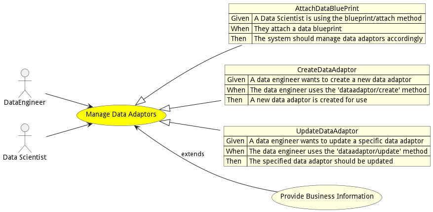

# Manage Data Adaptors

Manage Data Adaptors is the description

## Actors

* [DataEngineer](actor-dataengineer)
* [Data Scientist](actor-datascientist)

## Detail Scenarios

* [AttachDataBluePrint](#scenario-AttachDataBluePrint)
* [CreateDataAdaptor](#scenario-CreateDataAdaptor)
* [UpdateDataAdaptor](#scenario-UpdateDataAdaptor)

### Scenario Attach Data Blue Print

Attach Data Blue Print is the description

#### Steps

1. To Be Defined

#### Actors

* [Actor](actor-actor)

### Scenario Create Data Adaptor

Create Data Adaptor is the description

#### Steps

1. To Be Defined

#### Actors

* [Actor](actor-actor)

### Scenario Update Data Adaptor

Update Data Adaptor is the description

#### Steps

1. To Be Defined

#### Actors

* [Actor](actor-actor)

