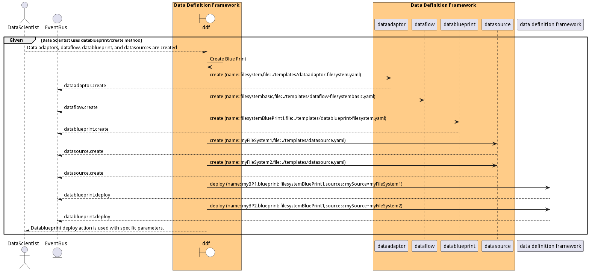

# Manage Data Blue Prints

Manage Data Blue Prints is the description

## Actors

* [DataEngineer](actor-dataengineer)
* [Data Scientist](actor-datascientist)

## Extends Use Cases

* [Provide Business Information](usecase-ProvideBusinessInformation)

## Detail Scenarios

* [CreateBluePrint](#scenario-CreateBluePrint)

### Scenario Create Blue Print

Create Blue Print is the description

#### Criteria

* Given - Data Scientist uses datablueprint/create method
* When - Data adaptors, dataflow, datablueprint, and datasources are created
* Then - Data Scientist uses datablueprint/create method

#### Steps
1. [dataadaptor create --name filesystem --file ./templates/dataadaptor-filesystem.yaml](#action-dataadaptor-create)
1. [dataflow create --name filesystembasic --file ./templates/dataflow-filesystembasic.yaml](#action-dataflow create)
1. [datablueprint create --name filesystemBluePrint1 --file ./templates/datablueprint-filesystem.yaml](#action-datablueprint create)
1. [datasource create --name myFileSystem1 --file ./templates/datasource.yaml](#action-datasource create)
1. [datasource create --name myFileSystem2 --file ./templates/datasource.yaml](#action-datasource create)
1. [diml ddf datablueprint deploy --name myBP1 --blueprint filesystemBluePrint1 --sources mySource=myFileSystem1](#action-diml ddf datablueprint deploy)
1. [diml ddf datablueprint deploy --name myBP2 --blueprint filesystemBluePrint1 --sources mySource=myFileSystem2](#action-diml ddf datablueprint deploy)

#### Actors

* [Data Scientist](actor-datascientist)

