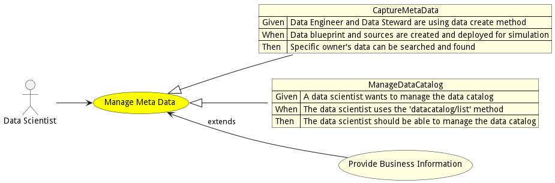
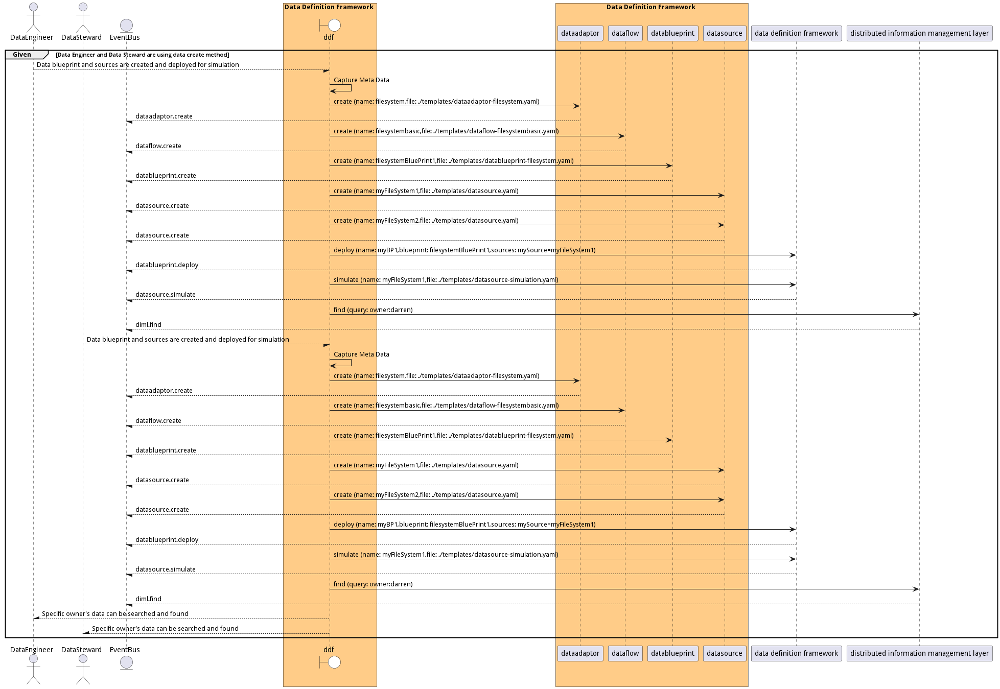
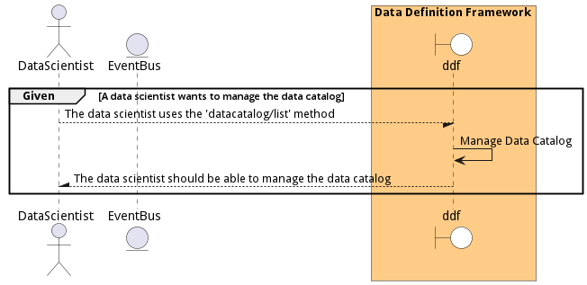

# Manage Meta Data

Manage Meta Data is the description

## Actors

* [Data Scientist](actor-datascientist)

## Detail Scenarios

* [CaptureMetaData](#scenario-CaptureMetaData)
* [ManageDataCatalog](#scenario-ManageDataCatalog)

### Scenario Capture Meta Data

Capture Meta Data is the description

#### Steps

1. [dataadaptor create --name filesystem --file ./templates/dataadaptor-filesystem.yaml](#action-dataadaptor-create)

1. [dataflow create --name filesystembasic --file ./templates/dataflow-filesystembasic.yaml](#action-dataflow-create)

1. [datablueprint create --name filesystemBluePrint1 --file ./templates/datablueprint-filesystem.yaml](#action-datablueprint-create)

1. [datasource create --name myFileSystem1 --file ./templates/datasource.yaml](#action-datasource-create)

1. [datasource create --name myFileSystem2 --file ./templates/datasource.yaml](#action-datasource-create)

1. [diml ddf/datablueprint/deploy --name myBP1 --blueprint filesystemBluePrint1 --sources mySource=myFileSystem1](#action-diml-ddf-datablueprint-deploy)

1. [diml ddf/datasource/simulate --name myFileSystem1 --file ./templates/datasource-simulation.yaml](#action-diml-ddf-datasource-simulate)

1. [diml find --query owner:darren](#action-diml-find)

#### Actors

* [Actor](actor-actor)

### Scenario Manage Data Catalog

Manage Data Catalog is the description

#### Steps

1. To Be Defined

#### Actors

* [Data Scientist](actor-datascientist)

