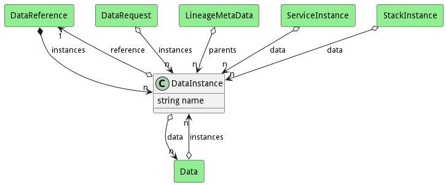

# DataInstance

The DataInstance class contains an instance of the data based on the data reference. The Instance is tied to specific service, application, or workload instance running in the system. This mapping of reference to instance is important in realizing the abstraction of the reference to something that can be used by the executable on the resources in the Softare Defined Infrastructure layer.

## Attributes

* name:string - Name of the DataInstance

## Associations

| Name | Cardinality | Class | Composition | Owner | Description |
| --- | --- | --- | --- | --- | --- |
| reference | 1 | DataReference | false | false |  |
| data | n | Data | false | false |  |

## Users of the Model

| Name | Cardinality | Class | Composition | Owner | Description |
| --- | --- | --- | --- | --- | --- |
| instances | n | DataRequest | false | false |  |
| parents | n | LineageMetaData | false | false |  |
| instances | n | Data |  |  | This is the Instance of the Data stored in the meta-data manager |
| instances | n | DataReference | true | true |  |
| data | n | ServiceInstance | false | false |  |
| data | n | StackInstance | false | false |  |

## Methods

<h2>Method Details</h2>
    

