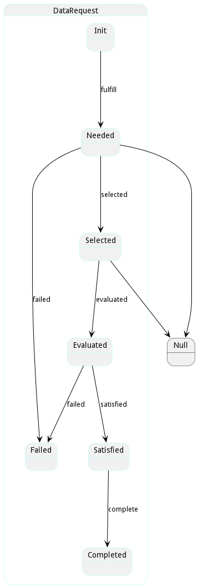

# DataRequest

This represents a request made for data in the system the data request is made with several data reservations coming back depending on the data request. More than one data reservation can be utilized depending on the policies in the data orchestrator. For example is a data reference states to get all car data then several reservations should  be used based on their data sources.

## Attributes

* name:string - Name of the Request being made
* ename:string - Extended Name of the Request being made. It Contains any parent request
* query:json - JSON structure for fdining the data in the data manager
* message:string - Last message about the data request

## Associations

| Name | Cardinality | Class | Composition | Owner | Description |
| --- | --- | --- | --- | --- | --- |
| dataReference | 1 | DataReference | false | false |  |
| reservations | n | DataReservation | false | true |  |
| instances | n | DataInstance | false | false |  |

## Users of the Model

| Name | Cardinality | Class | Composition | Owner | Description |
| --- | --- | --- | --- | --- | --- |
| request | 1 | DataReservation | false | false |  |

## State Net
The DataRequest has a state net corresponding to instances of the class. Each state transistion will emit an 
event that can be caught with a websocket client. The name of the event is the name of the state in all lower case.
The following diagram is the state net for this class.

| Name | Description | Events |
| --- | --- | --- |
| Init | Initial State for the Data Request | fulfill-&gt;Needed,  |
| Needed | Request needs to be satisfied. Anyone that can satisfy it should be notified. | selected-&gt;Selected, failed-&gt;Failed,  |
| Failed | The Request has failed to be fully satisfied. All reservations are rejected |  |
| Selected | The Request has been selected for target. Reservations are created. | evaluated-&gt;Evaluated,  |
| Satisfied | The Request if fully satisfied. The Reservations have been rejected or accepted | complete-&gt;Completed,  |
| Evaluated | The Request has been evaluated but not satisfied yet. | satisfied-&gt;Satisfied, failed-&gt;Failed,  |
| Completed | The Request is completed. |  |

## Methods

<h2>Method Details</h2>
    

