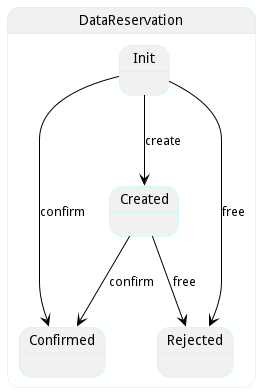

# DataReservation

Resrevation for utilixzing data and creating a data instance.

## Attributes

* cost:number - Cost of using the data

## Associations

| Name | Cardinality | Class | Composition | Owner | Description |
| --- | --- | --- | --- | --- | --- |
| data | 1 | Data | false | false |  |
| source | 1 | DataSource | false | false |  |
| request | 1 | DataRequest | false | false |  |

## Users of the Model

| Name | Cardinality | Class | Composition | Owner | Description |
| --- | --- | --- | --- | --- | --- |
| reservations | n | DataRequest | false | true |  |
| reservations | n | DataRequest | false | true |  |
| reservations | n | DataRequest | false | true |  |
| reservations | n | DataRequest | false | true |  |
| reservations | n | DataRequest | false | true |  |
| reservations | n | DataRequest | false | true |  |
| reservations | n | DataRequest | false | true |  |
| reservations | n | DataRequest | false | true |  |
| reservations | n | DataRequest | false | true |  |
| reservations | n | DataRequest | false | true |  |
| reservations | n | DataRequest | false | true |  |
| reservations | n | DataRequest | false | true |  |
| reservations | n | DataRequest | false | true |  |
| reservations | n | DataRequest | false | true |  |
| reservations | n | DataRequest | false | true |  |
| reservations | n | DataRequest | false | true |  |
| reservations | n | DataRequest | false | true |  |
| reservations | n | DataRequest | false | true |  |
| reservations | n | DataRequest | false | true |  |
| reservations | n | DataRequest | false | true |  |
| reservations | n | DataRequest | false | true |  |
| reservations | n | DataRequest | false | true |  |
| reservations | n | DataRequest | false | true |  |
| reservations | n | DataRequest | false | true |  |
| reservations | n | DataRequest | false | true |  |
| reservations | n | DataRequest | false | true |  |
| reservations | n | DataRequest | false | true |  |
| reservations | n | DataRequest | false | true |  |
| reservations | n | DataRequest | false | true |  |
| reservations | n | DataRequest | false | true |  |
| reservations | n | DataRequest | false | true |  |
| reservations | n | DataRequest | false | true |  |
| reservations | n | DataRequest | false | true |  |
| reservations | n | DataRequest | false | true |  |
| reservations | n | DataRequest | false | true |  |
| reservations | n | DataRequest | false | true |  |
| reservations | n | DataRequest | false | true |  |
| reservations | n | DataRequest | false | true |  |
| reservations | n | DataRequest | false | true |  |
| reservations | n | DataRequest | false | true |  |
| reservations | n | DataRequest | false | true |  |
| reservations | n | DataRequest | false | true |  |
| reservations | n | DataRequest | false | true |  |
| reservations | n | DataRequest | false | true |  |

## State Net

| Name | Description | Events |
| --- | --- | --- |
| Init |  | create-&gt;Created, confirm-&gt;Confirmed, free-&gt;Rejected,  |
| Created | Reservation is created and ready to be evaluated for best fit. | confirm-&gt;Confirmed, free-&gt;Rejected,  |
| Confirmed | Reservation is confirmed and the resources will be provisioned. |  |
| Rejected | Reservation was rejected and devices freed up. |  |

## Methods

<h2>Method Details</h2>
    

