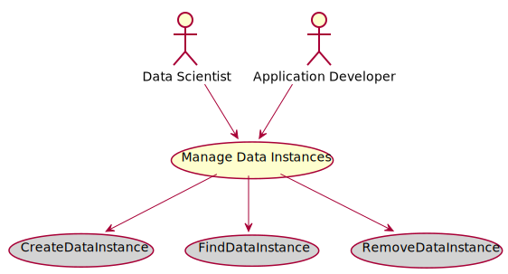
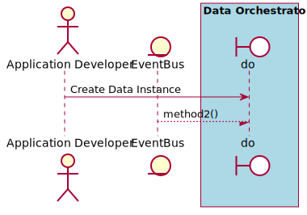
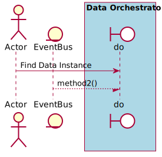
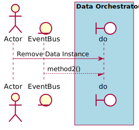

# Manage Data Instances

Manage Data Instances is the description

## Actors

* [Data Scientist](actor-datascientist)
* [Application Developer](actor-applicationdeveloper)

## Detail Scenarios

* [Manage Data Instances](#scenario-CreateDataInstance)
* [Manage Data Instances](#scenario-FindDataInstance)
* [Manage Data Instances](#scenario-RemoveDataInstance)

  
### Scenario Create Data Instance

Create Data Instance is the description

#### Steps

1. To Be Defined

#### Actors

* [Application Developer](actor-applicationdeveloper)

### Scenario Find Data Instance

Find Data Instance is the description

#### Steps

1. To Be Defined

#### Actors

* [Actor](actor-actor)

### Scenario Remove Data Instance

Remove Data Instance is the description

#### Steps

1. To Be Defined

#### Actors

* [Actor](actor-actor)

