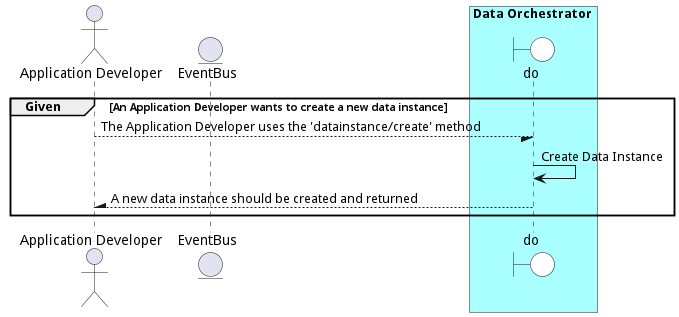

# Manage Data Instances

Manage Data Instances is the description

## Actors

* [Data Scientist](actor-datascientist)
* [Application Developer](actor-applicationdeveloper)

## Extends Use Cases

* [Provide Business Information](usecase-ProvideBusinessInformation)

## Detail Scenarios

* [CreateDataInstance](#scenario-CreateDataInstance)
* [FindDataInstance](#scenario-FindDataInstance)
* [RemoveDataInstance](#scenario-RemoveDataInstance)

### Scenario Create Data Instance

Create Data Instance is the description

#### Criteria

* Given - An Application Developer wants to create a new data instance
* When - The Application Developer uses the &#39;datainstance/create&#39; method
* Then - An Application Developer wants to create a new data instance

#### Steps
1. To Be Defined

#### Actors

* [Application Developer](actor-applicationdeveloper)

### Scenario Find Data Instance

Find Data Instance is the description

#### Criteria

* Given - DataEngineer has access to datainstance/find method
* When - DataEngineer uses the method to find a specific data instance
* Then - DataEngineer has access to datainstance/find method

#### Steps
1. To Be Defined

#### Actors

* [DataEngineer](actor-dataengineer)

### Scenario Remove Data Instance

Remove Data Instance is the description

#### Criteria

* Given - A DataEngineer has a specific data instance to remove
* When - The DataEngineer invokes the &#39;datainstance/destroy&#39; method
* Then - A DataEngineer has a specific data instance to remove

#### Steps
1. To Be Defined

#### Actors

* [DataEngineer](actor-dataengineer)

