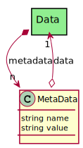

# MetaData

Meta-Data for the Data in the system. Name and Value pair.

## Attributes

* name:string - Name of the MetaData
* value:string - Value of the MetaData

## Associations

| Name | Cardinality | Class | Composition | Owner | Description |
| --- | --- | --- | --- | --- | --- |
| data | 1 | Data |  |  | This is a DataInstance Class that the meta-data is tied |

## Users of the Model

| Name | Cardinality | Class | Composition | Owner | Description |
| --- | --- | --- | --- | --- | --- |
| metadata | n | Data | false | true |  |

## Methods

<h2>Method Details</h2>
    

