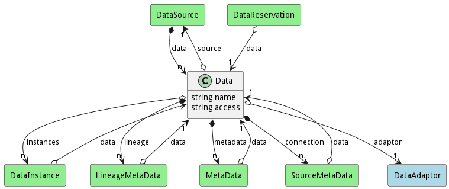

# Data

This class represents data that is stored in the system. It has a relationship with a StorageResource as all data must have someplace to reside. The access attribute is a catch all for how to access the data. It could be a connection string to a data like a database, a filesystem etc.. Specializations of the Data reference class know what to do with the access attribute.

## Attributes

* name:string - Name of the Data
* access:string - * access: string - A string that represents how to access the data. This could be a database connection string, file
system path, etc

## Associations

| Name | Cardinality | Class | Composition | Owner | Description |
| --- | --- | --- | --- | --- | --- |
| source | 1 | DataSource |  |  | This is the DataSource that owns the data |
| adaptor | 1 | DataAdaptor |  |  | This is the DataAdaptor for the Data, it shows how to connect to the data |
| instances | n | DataInstance |  |  | This is the Instance of the Data stored in the meta-data manager |
| lineage | n | LineageMetaData | false | true |  |
| metadata | n | MetaData | false | true |  |
| connection | n | SourceMetaData | false | true |  |

## Users of the Model

| Name | Cardinality | Class | Composition | Owner | Description |
| --- | --- | --- | --- | --- | --- |
| data | n | DataSource | true | true |  |
| data | n | DataInstance | false | false |  |
| data | 1 | DataReservation | false | false |  |
| data | 1 | MetaData |  |  | This is a DataInstance Class that the meta-data is tied |
| data | 1 | LineageMetaData |  |  | This is a DataInstance Class that the meta-data is tied |
| data | 1 | SourceMetaData |  |  | This is a DataInstance Class that the meta-data is tied |

## Methods

<h2>Method Details</h2>
    

