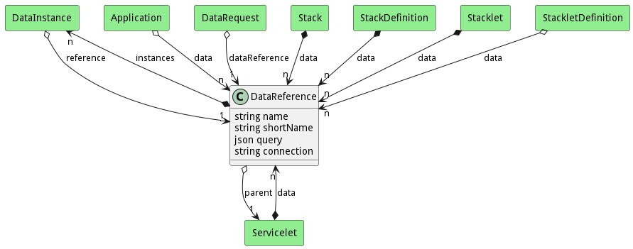
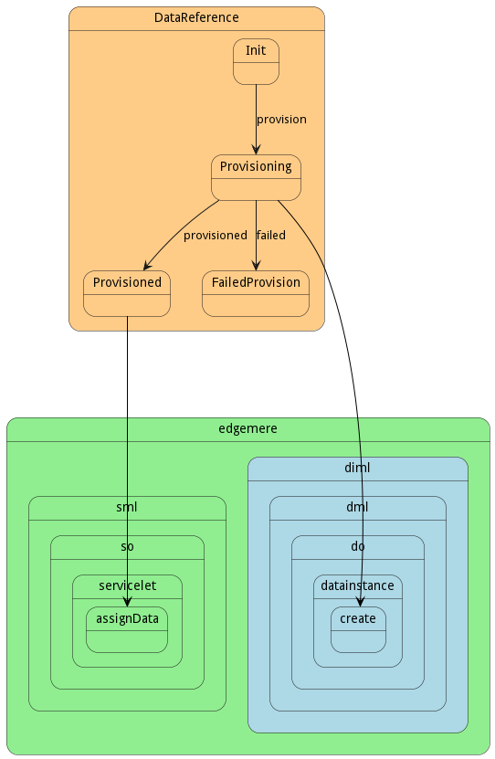

# DataReference

DataReference is used to abstract data requirements for Applications, Stacks and Services. These references are realized in the Data Orchestrator when it creates Data Instances based on the policies, and environment the ServiceInstance is running.

## Attributes

* name:string - Name of the Data Reference
* shortName:string - Short Name of the Data Reference
* query:json - JSON structure for finding the data in the data manager
* connection:string - Connection string for the Data Reference

## Associations

| Name | Cardinality | Class | Composition | Owner | Description |
| --- | --- | --- | --- | --- | --- |
| instances | n | DataInstance | true | true |  |
| parent | 1 | Servicelet | false | false |  |

## Users of the Model

| Name | Cardinality | Class | Composition | Owner | Description |
| --- | --- | --- | --- | --- | --- |
| data | n | Application | false | false |  |
| reference | 1 | DataInstance | false | false |  |
| dataReference | 1 | DataRequest | false | false |  |
| data | n | Servicelet | false | true | Data References to the data in the Stacklet |
| data | n | Stack | false | true | Data for the stack |
| data | n | StackDefinition | false | true | Data for the stack |
| data | n | Stacklet | false | true | Data References to the data in the Stacklet |
| data | n | StackletDefinition | false | false | Data References to the data in the Stacklet |

## State Net
The DataReference has a state net corresponding to instances of the class. Each state transistion will emit an 
event that can be caught with a websocket client. The name of the event is the name of the state in all lower case.
The following diagram is the state net for this class.

| Name | Description | Events |
| --- | --- | --- |
| Init | Initial State | provision-&gt;Provisioning,  |
| Provisioning | DataReference is being Provisioned | provisioned-&gt;Provisioned, failed-&gt;FailedProvision,  |
| Provisioned |  |  |
| FailedProvision |  |  |

## Methods

<h2>Method Details</h2>
    

