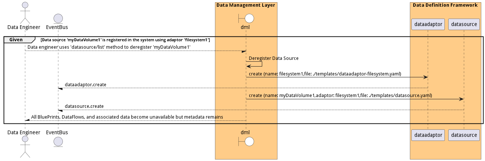

# Manage Data Sources

Manage Data Sources allows the Data Engineer to register data sources to the system.

## Actors

* [DataEngineer](actor-dataengineer)

## Detail Scenarios

* [DeregisterDataSource](#scenario-DeregisterDataSource)
* [RegisterDataSource](#scenario-RegisterDataSource)

### Scenario Deregister Data Source

Deregister Data Source allows the data engineer to remove a data source from the system. All BluePrints and DataFlows will no longer process data generated from the source. All data that has been registered to the Meta-data management system will be marked as unavailable, but the meta-data will continue to reside in the system.

#### Steps
1. [dataadaptor create --name filesystem1 --file ./templates/dataadaptor-filesystem.yaml](#action-dataadaptor-create)
1. [datasource create --name myDataVolume1 --adaptor filesystem1 --file ./templates/datasource.yaml](#action-datasource-create)

#### Actors

* [DataEngineer](actor-dataengineer)

### Scenario Register Data Source

Register Data Source to the system. This allows for data sources to be monitored. Data generated at the data source can now be processed by DataBluePrints.

#### Steps
1. [dataadaptor create --name filesystem1 --file ./templates/dataadaptor-filesystem.yaml](#action-dataadaptor-create)
1. [datasource create --name myDataVolume1 --adaptor filesystem1 --file ./templates/datasource.yaml](#action-datasource-create)
1. [datasource create --name myDataVolume2 --adaptor filesystem1 --parameters host=localhost, filesystem=/tmp/user2](#action-datasource-create)
1. [datasource create --name myDataVolume3 --adaptor filesystem1 --parameters host=localhost, filesystem=/tmp/user3](#action-datasource-create)
1. [datasource create --name myDataVolume4 --adaptor filesystem1 --parameters host=localhost, filesystem=/tmp/user4](#action-datasource-create)

#### Actors

* [DataEngineer](actor-dataengineer)

