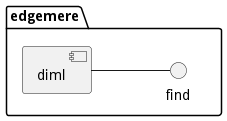
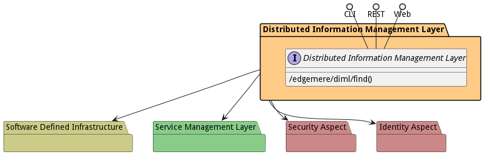

# Distributed Information Management Layer

Distributed Information Management Layer is a package that contains...

The Distributed Information Management Layer (DIML) focuses on the management of data across the ecosystem. Including
data lifecycle management, data security and governance, storage infrastructure, analytics, data sources, and
application data usage. Almost all of the actors of the architecture have some input into the DIML. Including
[Chief Data Officer](actor-cdo), [Data Steward](actor-datasteward), [IT Operations](actor-itops)
, [Application Developer](actor-applicationdeveloper)
[Data Scientist](actor-datascientist), and [Data Engineer](actor-dataengineer)

The DIML is the newest architectural element in the edgemere architecture. It was developed to handle the complexity of
managing data across multiple data centers, clouds, and IoT edge devices. This layer was created out of the
[Application Management Layer](package--egdemere-aml),[Sevice Management Layer](package-edgemere-sml), and
[Software Defined Infrastructure Layer](package--edgemere-sdi). It is a middleware layer that depends on
the [Software Defined Infrastructure Layer](package--edgemere-sdi), and a co-dependence on the
[Service Management Layer](package--edgemere-sml). The [Application Management Layer](package--edgemere-aml) depends on
the DIML.

There are many different approaches to working with data. All of these approaches can be boiled down to two major models
of operation: centralized processing and distributed processing. The centralized processing approach utilizes data
architecture to provide benefits to the end users. There are many data architectures for centralized processing, two of
which are Data Warehouse and Data Lakes. The centralized processing paradigm is good for some of the data use cases but
not all of them. As more systems are moving outside of the traditional data center walls, many of the centralized data
architectures fall apart. This is where distributed processing architectures like Data Meshs become important. The
Edgemere architect is flexible to handle the different modes of data processing.

## Data Mesh

In the Data Mesh (Distributed Data Lake) architecture the ability to move applications close to the data or move the
data close to the applications. In the mode of data processing data is analyzed in IoT Edge Devices and results are
pushed to the data center and linked together.

## Data Exchange

Another mode of operation that has emerged is taking the Data Mesh concept and extending that to different
classifications or owners of data. This specail case limits the movement of data and who has access to the data. This
use case is abundant in Government and Healthcare where privacy and classification regulations limit the ability to
freely access data. This architecture, Data Exchange, allows for policy gates to limit the data that can be passed back
to the application requesting the data. It also gives the ability to run analytics/services in the geo-fenced data site.

## Data Fabric

Data fabrics are the natural next architecture to emerge as it helps resolve some of the problems with data lake
architectures caused by centralizing all of the data. Data fabrics process data on the edge where the source generates
the data. This distributed architecture follows much of the same path that cloud technology did in the early 2000s and
includes centralized control, orchestration, and management of the data

## Data Mart
A data mart is a small data repository for structured data specific to a department. Tailored to the detailed 
problem statements, they contain copie/s of data from a limited number of sources and typically a smaller data set. Data marts usually limit access to the data and reports to one organization or a small group of users in one organization. Data scientists leverage Data Marts to build complex analytical models, generate timely periodic reports that require highly predictable performance and work with highly sensitive data and resulting reports.

## Intelligent Data Streams
DataStream architectures allow for processing data analytics in the stream of data. Each data stream manipulates the 
data as data is ingested and egressed to another application, report, or data stream. Data streams allow for data to 
be used anywhere in the ecosystem, including on the edge devices, in the data center, in the cloud, and even in transit between the different types of infrastructure. Analytics can be performed parallel across multiple devices by joining data streams through their ingress and egress ports.

The DIML architecture allows for multiple data architectures at the same time. The architecture allows a
[DataEngineer](actor-dataengineer) to easily build repeatable Blueprints geared to the different data architectural 
approaches. As a result, the same system or solution can utilize any of the data operating models described above.

## Use Cases

The following are the use cases of the Distributed Information Management Layer subsystem. Each use case has primary and secondary scenarios
that are elaborated in the use case descriptions.

## Users

The following are the actors of the Distributed Information Management Layer subsystem. This can include people, other subsystems
inside the solution and even external subsystems.

## Interface

The subsystem has a REST, CLI, WebSocket, and Web interface. Use Cases and Scenarios can use any or all
of the interfaces to perform the work that needs to be completed. The following  diagram shows how
users interact with the system.

* [ edgemere diml find](#action--edgemere-diml-find)

## Logical Artifacts

The Data Model for the  Distributed Information Management Layer subsystem shows how the different objects and classes of object interact
and their structure.

### Sub Packages

The Distributed Information Management Layer subsystem has sub packages as well. These subsystems are logical components to better
organize the architecture and make it easier to analyze, understand, design, and implement.

* [Common Data Service](package--edgemere-diml-cds)
* [Data Definition Framework](package--edgemere-diml-ddf)
* [Data Management Layer](package--edgemere-diml-dml)

### Classes

The following are the classes in the data model of the Distributed Information Management Layer subsystem.

## Deployment Architecture

This subsystem is deployed using micro-services as shown in the diagram below. The 'micro' module is
used to implement the micro-services in the system. The subsystem also has an CLI, REST and Web Interface
exposed through a nodejs application. The nodejs application will interface with the micro-services and
can monitor and drive work-flows through the mesh of micro-services. The deployment of the subsystem is
dependent on the environment it is deployed. This subsystem has the following environments:
* [dev](environment--edgemere-diml-dev)
* [test](environment--edgemere-diml-test)
* [prod](environment--edgemere-diml-prod)

## Physical Architecture

The Distributed Information Management Layer subsystem is physically laid out on a hybrid cloud infrastructure. Each microservice belongs
to a secure micro-segmented network. All of the micro-services communicate to each other and the main app through a
REST interface. A Command Line Interface (CLI), REST or Web User interface for the app is how other subsystems or actors
interact. Requests are forwarded to micro-services through the REST interface of each micro-service. The subsystem has
the a unique layout based on the environment the physical space. The following are the environments for this
subsystems.
* [dev](environment--edgemere-diml-dev)
* [test](environment--edgemere-diml-test)
* [prod](environment--edgemere-diml-prod)

## Micro-Services

These are the micro-services for the subsystem. The combination of the micro-services help implement
the subsystem's logic.

### dev

Detail information for the [dev environment](environment--edgemere-diml-dev)
can be found [here](environment--edgemere-diml-dev)

Services in the dev environment

* web : diml_web
* diml_cds : diml_cds
* diml_ddf : diml_ddf
* diml_dml : diml_dml

### test

Detail information for the [test environment](environment--edgemere-diml-test)
can be found [here](environment--edgemere-diml-test)

Services in the test environment

* web : diml_web
* diml_cds : diml_cds
* diml_ddf : diml_ddf
* diml_dml : diml_dml

### prod

Detail information for the [prod environment](environment--edgemere-diml-prod)
can be found [here](environment--edgemere-diml-prod)

Services in the prod environment

* web : diml_web
* diml_cds : diml_cds
* diml_ddf : diml_ddf
* diml_dml : diml_dml

## Activities and Flows
The Distributed Information Management Layer subsystem provides the following activities and flows that help satisfy the use
cases and scenarios of the subsystem.

### Messages Sent

| Event | Description | Emitter |
|-------|-------------|---------|

## Interface Details
The Distributed Information Management Layer subsystem has a well defined interface. This interface can be accessed using a
command line interface (CLI), REST interface, and Web user interface. This interface is how all other
subsystems and actors can access the system.

### Action  edgemere diml find

* REST - /edgemere/diml/find?query=json&amp;file=YAML
* bin -  edgemere diml find --query json --file YAML
* js - .edgemere.diml.find({ query:json,file:YAML })

#### Description
Find the data and start up an instance

#### Parameters

| Name | Type | Required | Description |
|---|---|---|---|
| query | json |false | Query of the data to find |
| file | YAML |false | YAML file with complex query |

