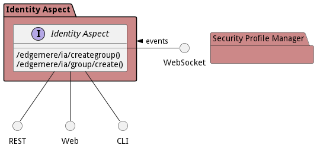
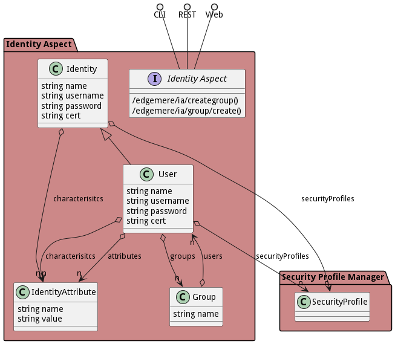

# Identity Aspect

Identity Aspect is a package that contains...

The Identity Aspect is used through all layers in the Architecture. This aspect is responsible for the trusted
identity of users; device in the data center, in the cloud, and on the edge; services and applications; and data.
Having a common indentity management system is key to having consistency in the system. Having that identity
trusted means that I can establish a trusted ecosystem in which data, applications and hardware can deliver
solutions that can be trusted.

The Identity Aspect has key sub-systems that help in managing identity: Access, Authorization, Authentication and
Key Management. Being able to Authenticate an entity in the system is the first step in identity management. Keys
are used to certify and attest the authentication of an entity, human or machine. Once an entity is authenicated,
it is given authority to access other resources in the system. By giving identity ot every element in the system,
mishaps in security can be mitigated and better controlled.

## Use Cases

The following are the use cases of the Identity Aspect subsystem. Each use case has primary and secondary scenarios
that are elaborated in the use case descriptions.

## Users

The following are the actors of the Identity Aspect subsystem. This can include people, other subsystems
inside the solution and even external subsystems.

## Interface

The subsystem has a REST, CLI, WebSocket, and Web interface. Use Cases and Scenarios can use any or all
of the interfaces to perform the work that needs to be completed. The following  diagram shows how
users interact with the system.

## Logical Artifacts

The Data Model for the  Identity Aspect subsystem shows how the different objects and classes of object interact
and their structure.

### Sub Packages

The Identity Aspect subsystem has sub packages as well. These subsystems are logical components to better
organize the architecture and make it easier to analyze, understand, design, and implement.

### Classes

The following are the classes in the data model of the Identity Aspect subsystem.

* [Group](class-Group)
* [Identity](class-Identity)
* [IdentityAttribute](class-IdentityAttribute)
* [User](class-User)

## Deployment Architecture

This subsystem is deployed using micro-services as shown in the diagram below. The 'micro' module is
used to implement the micro-services in the system. The subsystem also has an CLI, REST and Web Interface
exposed through a nodejs application. The nodejs application will interface with the micro-services and
can monitor and drive work-flows through the mesh of micro-services. The deployment of the subsystem is
dependent on the environment it is deployed. This subsystem has the following environments:
* [dev](environment--edgemere-ia-dev)
* [test](environment--edgemere-ia-test)
* [prod](environment--edgemere-ia-prod)

## Physical Architecture

The Identity Aspect subsystem is physically laid out on a hybrid cloud infrastructure. Each microservice belongs
to a secure micro-segmented network. All of the micro-services communicate to each other and the main app through a
REST interface. A Command Line Interface (CLI), REST or Web User interface for the app is how other subsystems or actors
interact. Requests are forwarded to micro-services through the REST interface of each micro-service. The subsystem has
the a unique layout based on the environment the physical space. The following are the environments for this
subsystems.
* [dev](environment--edgemere-ia-dev)
* [test](environment--edgemere-ia-test)
* [prod](environment--edgemere-ia-prod)

## Micro-Services

These are the micro-services for the subsystem. The combination of the micro-services help implement
the subsystem's logic.

### dev

Detail information for the [dev environment](environment--edgemere-ia-dev)
can be found [here](environment--edgemere-ia-dev)

Services in the dev environment

* web : ia_web

### test

Detail information for the [test environment](environment--edgemere-ia-test)
can be found [here](environment--edgemere-ia-test)

Services in the test environment

* web : ia_web

### prod

Detail information for the [prod environment](environment--edgemere-ia-prod)
can be found [here](environment--edgemere-ia-prod)

Services in the prod environment

* web : ia_web

## Activities and Flows
The Identity Aspect subsystem provides the following activities and flows that help satisfy the use
cases and scenarios of the subsystem.

### Messages Sent

| Event | Description | Emitter |
|-------|-------------|---------|
| group.create |  When an object of type Group is created. | Group
| group.destroy |  When an object of type Group is destroyed. | Group
| group.updated |  When an object of type Group has an attribute or association updated. | Group
| identity.create |  When an object of type Identity is created. | Identity
| identity.destroy |  When an object of type Identity is destroyed. | Identity
| identity.updated |  When an object of type Identity has an attribute or association updated. | Identity
| identityattribute.create |  When an object of type IdentityAttribute is created. | IdentityAttribute
| identityattribute.destroy |  When an object of type IdentityAttribute is destroyed. | IdentityAttribute
| identityattribute.updated |  When an object of type IdentityAttribute has an attribute or association updated. | IdentityAttribute
| user.create |  When an object of type User is created. | User
| user.destroy |  When an object of type User is destroyed. | User
| user.updated |  When an object of type User has an attribute or association updated. | User

## Interface Details
The Identity Aspect subsystem has a well defined interface. This interface can be accessed using a
command line interface (CLI), REST interface, and Web user interface. This interface is how all other
subsystems and actors can access the system.

