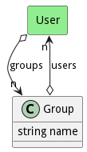

# Group

Group representing a set of identities

## Attributes

* name:string - Name of the group

## Associations

| Name | Cardinality | Class | Composition | Owner | Description |
| --- | --- | --- | --- | --- | --- |
| users | n | User | false | false |  |

## Users of the Model

| Name | Cardinality | Class | Composition | Owner | Description |
| --- | --- | --- | --- | --- | --- |
| groups | n | User | false | false |  |

## Methods

<h2>Method Details</h2>
    

