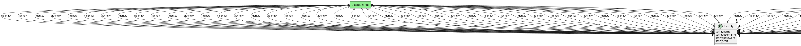

# Identity

Identity of the entity in the system

## Attributes

* name:string - Name of the identity
* username:string - UserName of the identity
* password:string - Password of the identity
* cert:string - Certificate of the identity

## Associations

No associations

## Users of the Model

| Name | Cardinality | Class | Composition | Owner | Description |
| --- | --- | --- | --- | --- | --- |
| identity | 1 | DataBluePrint | false | false |  |
| identity | 1 | DataBluePrintInstance | false | false |  |

## Methods

<h2>Method Details</h2>
    

