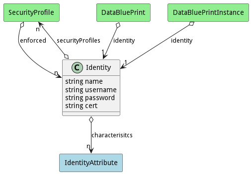

# Identity

Identity of the entity in the system

## Attributes

* name:string - Name of the identity
* username:string - UserName of the identity
* password:string - Password of the identity
* cert:string - Certificate of the identity

## Associations

| Name | Cardinality | Class | Composition | Owner | Description |
| --- | --- | --- | --- | --- | --- |
| securityProfiles | n | SecurityProfile |  |  |  |
| characterisitcs | n | IdentityAttribute |  |  |  |

## Users of the Model

| Name | Cardinality | Class | Composition | Owner | Description |
| --- | --- | --- | --- | --- | --- |
| identity | 1 | DataBluePrint | false | false |  |
| identity | 1 | DataBluePrintInstance | false | false |  |
| enforced | n | SecurityProfile |  |  | This is the list of identities being managed by the profile. The profile enforces the policies against they identities. |

## Methods

<h2>Method Details</h2>
    

