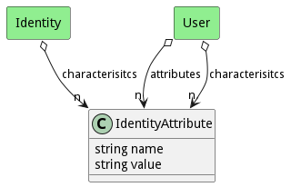

# IdentityAttribute

IdentityAttributes enable attribute based access controls. A User has attributes defined name value pairs that are then used to define policies for accessing resources, data, and applications

## Attributes

* name:string - name of the attribute
* value:string - Value of the attribute

## Associations

No associations

## Users of the Model

| Name | Cardinality | Class | Composition | Owner | Description |
| --- | --- | --- | --- | --- | --- |
| characterisitcs | n | Identity |  |  |  |
| attributes | n | User | false | false |  |
| characterisitcs | n | User |  |  |  |

## Methods

<h2>Method Details</h2>
    

