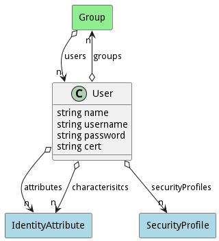

# User

User of the system

## Attributes

* name:string - Name of the user
* username:string - UserName of the identity
* password:string - Password of the identity
* cert:string - Certificate of the identity

## Associations

| Name | Cardinality | Class | Composition | Owner | Description |
| --- | --- | --- | --- | --- | --- |
| groups | n | Group | false | false |  |
| attributes | n | IdentityAttribute | false | false |  |
| securityProfiles | n | SecurityProfile |  |  |  |
| characterisitcs | n | IdentityAttribute |  |  |  |

## Users of the Model

| Name | Cardinality | Class | Composition | Owner | Description |
| --- | --- | --- | --- | --- | --- |
| users | n | Group | false | false |  |

## Methods

<h2>Method Details</h2>
    

