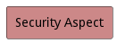
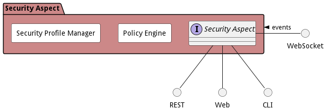
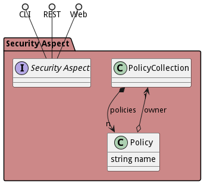

# Security Aspect

Security Aspect contains security tools and subsystems that are used throughout the architecture.

The Security Aspect is used in every layer of the architecture. The aspect was developed such that all layers in the
architecture has a common mechanism to perform common security use cases, such as, encryption, detection, remediation,
and root of trust.

Because security spans all of the layers the aspect also coordinates the use cases across the layers.

## Use Cases

The following are the use cases of the Security Aspect subsystem. Each use case has primary and secondary scenarios
that are elaborated in the use case descriptions.

## Users

The following are the actors of the Security Aspect subsystem. This can include people, other subsystems
inside the solution and even external subsystems.

## Interface

The subsystem has a REST, CLI, WebSocket, and Web interface. Use Cases and Scenarios can use any or all
of the interfaces to perform the work that needs to be completed. The following  diagram shows how
users interact with the system.

## Logical Artifacts

The Data Model for the  Security Aspect subsystem shows how the different objects and classes of object interact
and their structure.

### Sub Packages

The Security Aspect subsystem has sub packages as well. These subsystems are logical components to better
organize the architecture and make it easier to analyze, understand, design, and implement.

* [Policy Engine](package--edgemere-sa-pe)
* [Security Profile Manager](package--edgemere-sa-spm)

### Classes

The following are the classes in the data model of the Security Aspect subsystem.

* [Policy](class-Policy)
* [PolicyCollection](class-PolicyCollection)

## Deployment Architecture

This subsystem is deployed using micro-services as shown in the diagram below. The 'micro' module is
used to implement the micro-services in the system. The subsystem also has an CLI, REST and Web Interface
exposed through a nodejs application. The nodejs application will interface with the micro-services and
can monitor and drive work-flows through the mesh of micro-services. The deployment of the subsystem is
dependent on the environment it is deployed. This subsystem has the following environments:
* [dev](environment--edgemere-sa-dev)
* [test](environment--edgemere-sa-test)
* [prod](environment--edgemere-sa-prod)

## Physical Architecture

The Security Aspect subsystem is physically laid out on a hybrid cloud infrastructure. Each microservice belongs
to a secure micro-segmented network. All of the micro-services communicate to each other and the main app through a
REST interface. A Command Line Interface (CLI), REST or Web User interface for the app is how other subsystems or actors
interact. Requests are forwarded to micro-services through the REST interface of each micro-service. The subsystem has
the a unique layout based on the environment the physical space. The following are the environments for this
subsystems.
* [dev](environment--edgemere-sa-dev)
* [test](environment--edgemere-sa-test)
* [prod](environment--edgemere-sa-prod)

## Micro-Services

These are the micro-services for the subsystem. The combination of the micro-services help implement
the subsystem's logic.

### dev

Detail information for the [dev environment](environment--edgemere-sa-dev)
can be found [here](environment--edgemere-sa-dev)

Services in the dev environment

* frontend : sa_web
* gw : sa_gw

### test

Detail information for the [test environment](environment--edgemere-sa-test)
can be found [here](environment--edgemere-sa-test)

Services in the test environment

* frontend : sa_web
* gw : sa_gw

### prod

Detail information for the [prod environment](environment--edgemere-sa-prod)
can be found [here](environment--edgemere-sa-prod)

Services in the prod environment

* frontend : sa_web
* gw : sa_gw

## Activities and Flows
The Security Aspect subsystem provides the following activities and flows that help satisfy the use
cases and scenarios of the subsystem.

### Messages Sent

TBD

## Interface Details
The Security Aspect subsystem has a well defined interface. This interface can be accessed using a
command line interface (CLI), REST interface, and Web user interface. This interface is how all other
subsystems and actors can access the system.

