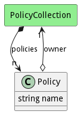

# Policy

policy can be applied to any entity in the system including Applications, Stacks, Resource, Devices, ...

## Attributes

* name:string - Name of the policy

## Associations

| Name | Cardinality | Class | Composition | Owner | Description |
| --- | --- | --- | --- | --- | --- |
| owner | 1 | PolicyCollection | false | false |  |

## Users of the Model

| Name | Cardinality | Class | Composition | Owner | Description |
| --- | --- | --- | --- | --- | --- |
| policies | n | PolicyCollection | true | true |  |

## Methods

<h2>Method Details</h2>
    

