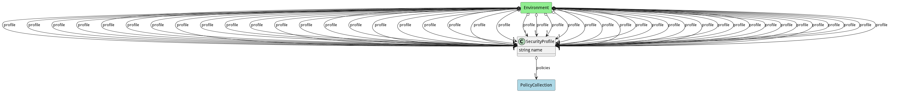

# SecurityProfile

A SecurityProfile allows security experts to develop a common profile that can be deployed across multiple environments, services, applications, workloads, based on security identities.

## Attributes

* name:string - Name of the security profile

## Associations

| Name | Cardinality | Class | Composition | Owner | Description |
| --- | --- | --- | --- | --- | --- |
| policies | 1 | PolicyCollection | false | false | This is the list of policies for the profile. |
| enforced | n | Identity |  |  | This is the list of identities being managed by the profile. The profile enforces the policies against they identities. |

## Users of the Model

| Name | Cardinality | Class | Composition | Owner | Description |
| --- | --- | --- | --- | --- | --- |
| profile | 1 | Environment | false | false |  |
| securityProfiles | n | Identity |  |  |  |
| securityProfiles | n | User |  |  |  |

## Methods
* [attach() - Attach a security profile to a identity in the system.](#action-attach)
* [deploy() - Deploy a security profile.](#action-deploy)
* [destroy() - Destroy a security profile.](#action-destroy)
* [disable() - Disable a security profile.](#action-disable)
* [enable() - Enable a security profile.](#action-enable)
* [status() - Return the status of the security profile, including state, policies and enforced identities.](#action-status)
* [test() - Test a security profile against conflicts with policies contained in the profile and against other profiles.](#action-test)

<h2>Method Details</h2>
    
### Action securityprofile attach

* REST - securityprofile/attach?profile=string&amp;identity=string
* bin - securityprofile attach --profile string --identity string
* js - securityprofile.attach({ profile:string,identity:string })

#### Description
Attach a security profile to a identity in the system.

#### Parameters

| Name | Type | Required | Description |
|---|---|---|---|
| profile | string |true | Name of the security profile. |
| identity | string |true | Name of the identity element in the system. |

### Action securityprofile deploy

* REST - securityprofile/deploy?name=string
* bin - securityprofile deploy --name string
* js - securityprofile.deploy({ name:string })

#### Description
Deploy a security profile.

#### Parameters

| Name | Type | Required | Description |
|---|---|---|---|
| name | string |true | name of the security profile. |

### Action securityprofile destroy

* REST - securityprofile/destroy?name=string
* bin - securityprofile destroy --name string
* js - securityprofile.destroy({ name:string })

#### Description
Destroy a security profile.

#### Parameters

| Name | Type | Required | Description |
|---|---|---|---|
| name | string |true | name of the security profile. |

### Action securityprofile disable

* REST - securityprofile/disable?name=string
* bin - securityprofile disable --name string
* js - securityprofile.disable({ name:string })

#### Description
Disable a security profile.

#### Parameters

| Name | Type | Required | Description |
|---|---|---|---|
| name | string |true | name of the security profile. |

### Action securityprofile enable

* REST - securityprofile/enable?name=string
* bin - securityprofile enable --name string
* js - securityprofile.enable({ name:string })

#### Description
Enable a security profile.

#### Parameters

| Name | Type | Required | Description |
|---|---|---|---|
| name | string |true | name of the security profile. |

### Action securityprofile status

* REST - securityprofile/status?name=string
* bin - securityprofile status --name string
* js - securityprofile.status({ name:string })

#### Description
Return the status of the security profile, including state, policies and enforced identities.

#### Parameters

| Name | Type | Required | Description |
|---|---|---|---|
| name | string |true | name of the security profile. |

### Action securityprofile test

* REST - securityprofile/test?name=string
* bin - securityprofile test --name string
* js - securityprofile.test({ name:string })

#### Description
Test a security profile against conflicts with policies contained in the profile and against other profiles.

#### Parameters

| Name | Type | Required | Description |
|---|---|---|---|
| name | string |true | name of the security profile. |

