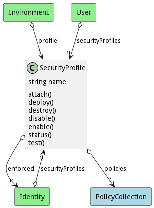

# SecurityProfile

A SecurityProfile allows security experts to develop a common profile that can be deployed across multiple environments, services, applications, workloads, based on security identities.

## Attributes

* name:string - Name of the security profile

## Associations

| Name | Cardinality | Class | Composition | Owner | Description |
| --- | --- | --- | --- | --- | --- |
| policies | 1 | PolicyCollection | false | false |  |

## Users of the Model

| Name | Cardinality | Class | Composition | Owner | Description |
| --- | --- | --- | --- | --- | --- |
| profile | 1 | Environment | false | false |  |
| profile | 1 | Environment | false | false |  |
| profile | 1 | Environment | false | false |  |
| profile | 1 | Environment | false | false |  |
| profile | 1 | Environment | false | false |  |
| profile | 1 | Environment | false | false |  |
| profile | 1 | Environment | false | false |  |
| profile | 1 | Environment | false | false |  |
| profile | 1 | Environment | false | false |  |
| profile | 1 | Environment | false | false |  |
| profile | 1 | Environment | false | false |  |
| profile | 1 | Environment | false | false |  |
| profile | 1 | Environment | false | false |  |
| profile | 1 | Environment | false | false |  |
| profile | 1 | Environment | false | false |  |
| profile | 1 | Environment | false | false |  |
| profile | 1 | Environment | false | false |  |
| profile | 1 | Environment | false | false |  |
| profile | 1 | Environment | false | false |  |
| profile | 1 | Environment | false | false |  |
| profile | 1 | Environment | false | false |  |
| profile | 1 | Environment | false | false |  |
| profile | 1 | Environment | false | false |  |
| profile | 1 | Environment | false | false |  |
| profile | 1 | Environment | false | false |  |
| profile | 1 | Environment | false | false |  |
| profile | 1 | Environment | false | false |  |
| profile | 1 | Environment | false | false |  |
| profile | 1 | Environment | false | false |  |
| profile | 1 | Environment | false | false |  |
| profile | 1 | Environment | false | false |  |
| profile | 1 | Environment | false | false |  |
| profile | 1 | Environment | false | false |  |
| profile | 1 | Environment | false | false |  |
| profile | 1 | Environment | false | false |  |
| profile | 1 | Environment | false | false |  |
| profile | 1 | Environment | false | false |  |
| profile | 1 | Environment | false | false |  |
| profile | 1 | Environment | false | false |  |
| profile | 1 | Environment | false | false |  |
| profile | 1 | Environment | false | false |  |
| profile | 1 | Environment | false | false |  |
| profile | 1 | Environment | false | false |  |
| profile | 1 | Environment | false | false |  |

## Methods

<h2>Method Details</h2>
    

