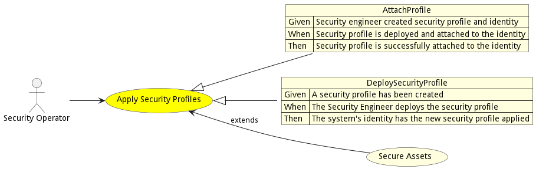

# Apply Security Profiles

Apply Security Profiles is the description

## Actors

* [Security Operator](actor-securityoperator)

## Detail Scenarios

* [AttachProfile](#scenario-AttachProfile)
* [DeploySecurityProfile](#scenario-DeploySecurityProfile)

### Scenario Attach Profile

Attach Profile is the description

#### Steps
1. [securityprofile create --name secProfile1 --file ./templates/secprofile.yml](#action-securityprofile-create)
1. [identity create --name ID1 --file ./templates/identity.yml](#action-identity-create)
1. [securityprofile deploy --name secProfile1](#action-securityprofile-deploy)
1. [securityprofile attach --profile secProfile1 --identity ID1](#action-securityprofile-attach)

#### Actors

* [SecurityEngineer](actor-securityengineer)

### Scenario Deploy Security Profile

Deploy a Security Profile against an identity in the system.

#### Steps
1. [securityprofile create --name secProfile1 --file ./templates/secprofile.yml](#action-securityprofile-create)
1. [securityprofile deploy --name secProfile1](#action-securityprofile-deploy)

#### Actors

* [SecurityEngineer](actor-securityengineer)

