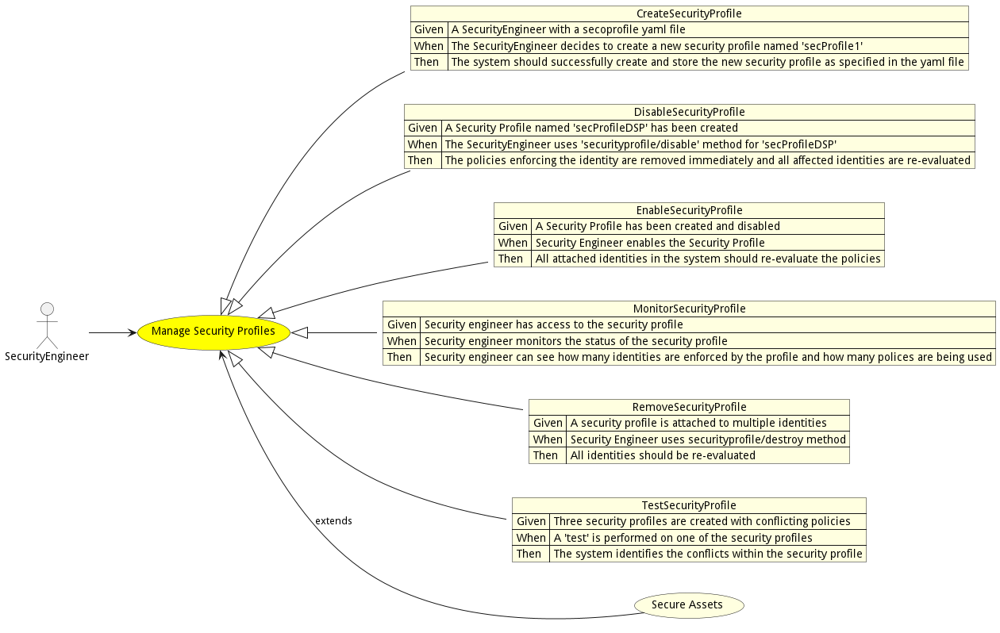
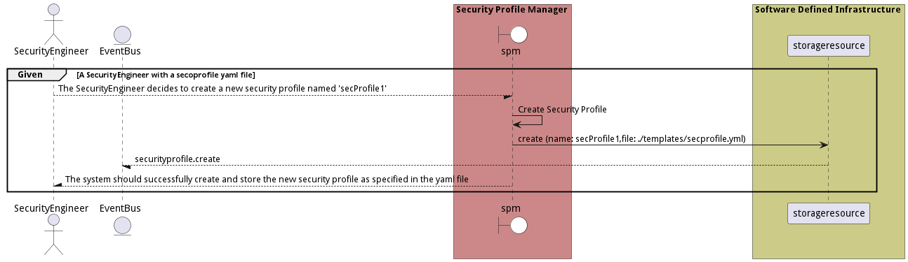
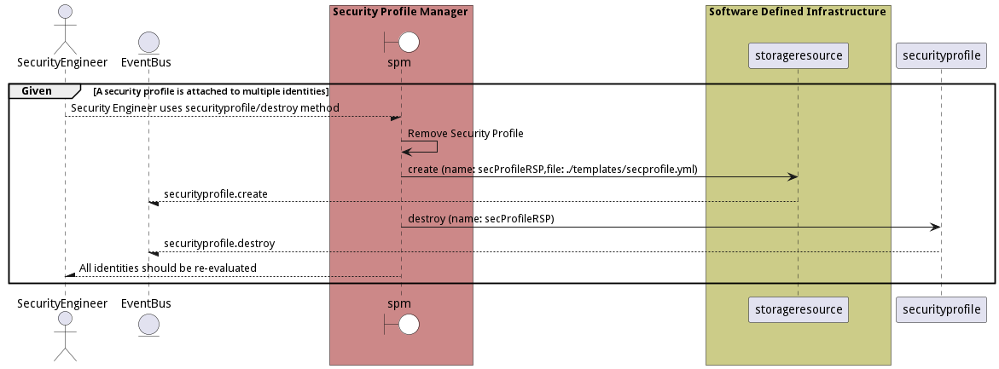

# Manage Security Profiles

Manage Security Profiles allows the security engineer to create, updated, and destroy security profiles in the system. Security profiles are attached to identity elements in the system and enforce security policies contained in the profiles.

## Actors

* [SecurityEngineer](actor-securityengineer)

## Extends Use Cases

* [Secure Assets](usecase-SecureAssets)

## Detail Scenarios

* [CreateSecurityProfile](#scenario-CreateSecurityProfile)
* [DisableSecurityProfile](#scenario-DisableSecurityProfile)
* [EnableSecurityProfile](#scenario-EnableSecurityProfile)
* [MonitorSecurityProfile](#scenario-MonitorSecurityProfile)
* [RemoveSecurityProfile](#scenario-RemoveSecurityProfile)
* [TestSecurityProfile](#scenario-TestSecurityProfile)

### Scenario Create Security Profile

Create Security Profile from a secoprofile yaml file.

#### Steps
1. [securityprofile create --name secProfile1 --file ./templates/secprofile.yml](#action-securityprofile-create)

#### Actors

* [SecurityEngineer](actor-securityengineer)

### Scenario Disable Security Profile

Disable Security Profile that has been created. This should remove the policies enforcing the identity immediately. All identities effected should be re-evaluated.

#### Steps
1. [securityprofile create --name secProfileDSP --file ./templates/secprofile.yml](#action-securityprofile-create)
1. [securityprofile disable --name secProfileDSP](#action-securityprofile-disable)

#### Actors

* [SecurityEngineer](actor-securityengineer)

### Scenario Enable Security Profile

Enable Security Profile should force a re-evaluation of the policies on all of the attached identities in the system.

#### Steps
1. [securityprofile create --name secProfileESP --file ./templates/secprofile.yml](#action-securityprofile-create)
1. [securityprofile disable --name secProfileESP](#action-securityprofile-disable)
1. [securityprofile enable --name secProfileESP](#action-securityprofile-enable)

#### Actors

* [SecurityEngineer](actor-securityengineer)

### Scenario Monitor Security Profile

Monitor Security Profile allows the security engineer to monitor the status of the security profile. Including how many identities are enforced by the profile and how many polices are being used.

#### Steps
1. [securityprofile create --name secProfileMSP --file ./templates/secprofile.yml](#action-securityprofile-create)
1. [securityprofile status --name secProfileMSP](#action-securityprofile-status)

#### Actors

* [SecurityEngineer](actor-securityengineer)

### Scenario Remove Security Profile

Remove Security Profile that is attached to multiple identities. All identities should be re-evaluated when a profile is destroyed.

#### Steps
1. [securityprofile create --name secProfileRSP --file ./templates/secprofile.yml](#action-securityprofile-create)
1. [securityprofile destroy --name secProfileRSP](#action-securityprofile-destroy)

#### Actors

* [SecurityEngineer](actor-securityengineer)

### Scenario Test Security Profile

Test Security Profile if the profile has conflicting policies and if the profile conflicts with other profiles in the system and when it is attached.

#### Steps
1. [securityprofile create --name secProfileTSP1 --file ./templates/secprofile.yml](#action-securityprofile-create)
1. [securityprofile create --name secProfileTSP2 --file ./templates/secprofile.yml](#action-securityprofile-create)
1. [securityprofile create --name secProfileTSP3 --file ./templates/secprofile.yml](#action-securityprofile-create)
1. [securityprofile test --name secProfileTSP1](#action-securityprofile-test)

#### Actors

* [SecurityEngineer](actor-securityengineer)

