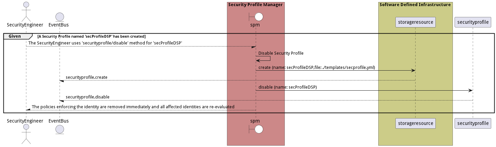
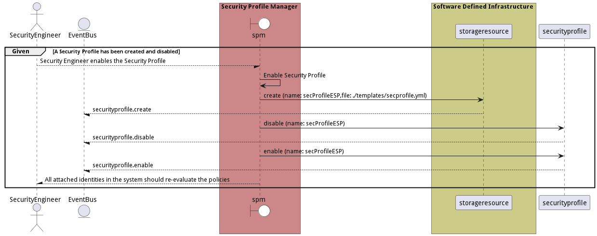
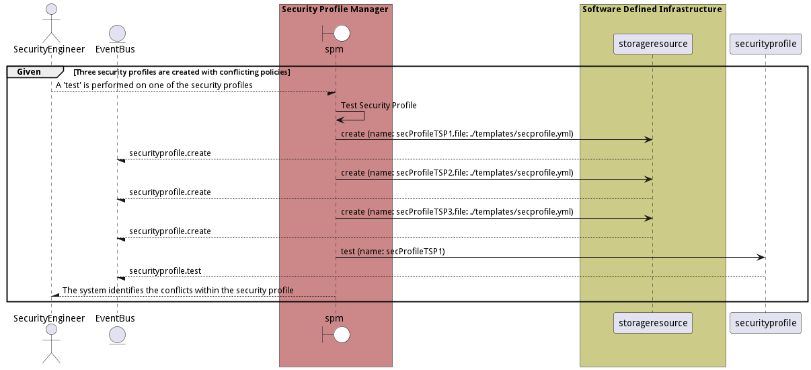

# Manage Security Profiles

Manage Security Profiles is the description

## Actors

* [Actor](actor-actor)

## Detail Scenarios

* [CreateSecurityProfile](#scenario-CreateSecurityProfile)
* [DisableSecurityProfile](#scenario-DisableSecurityProfile)
* [EnableSecurityProfile](#scenario-EnableSecurityProfile)
* [MonitorSecurityProfile](#scenario-MonitorSecurityProfile)
* [RemoveSecurityProfile](#scenario-RemoveSecurityProfile)
* [TestSecurityProfile](#scenario-TestSecurityProfile)

### Scenario Create Security Profile

Create Security Profile is the description

#### Steps

1. [data list --name hello --file ./templates/world.yml](#action-data-list)

1. [data list --name hello --file ./templates/world.yml](#action-data-list)

#### Actors

* [Actor](actor-actor)

### Scenario Disable Security Profile

Disable Security Profile is the description

#### Steps

1. [data list --name hello --file ./templates/world.yml](#action-data-list)

1. [data list --name hello --file ./templates/world.yml](#action-data-list)

#### Actors

* [Actor](actor-actor)

### Scenario Enable Security Profile

Enable Security Profile is the description

#### Steps

1. [data list --name hello --file ./templates/world.yml](#action-data-list)

1. [data list --name hello --file ./templates/world.yml](#action-data-list)

#### Actors

* [Actor](actor-actor)

### Scenario Monitor Security Profile

Monitor Security Profile is the description

#### Steps

1. [data list --name hello --file ./templates/world.yml](#action-data-list)

1. [data list --name hello --file ./templates/world.yml](#action-data-list)

#### Actors

* [Actor](actor-actor)

### Scenario Remove Security Profile

Remove Security Profile is the description

#### Steps

1. [data list --name hello --file ./templates/world.yml](#action-data-list)

1. [data list --name hello --file ./templates/world.yml](#action-data-list)

#### Actors

* [Actor](actor-actor)

### Scenario Test Security Profile

Test Security Profile is the description

#### Steps

1. [data list --name hello --file ./templates/world.yml](#action-data-list)

1. [data list --name hello --file ./templates/world.yml](#action-data-list)

#### Actors

* [Actor](actor-actor)

