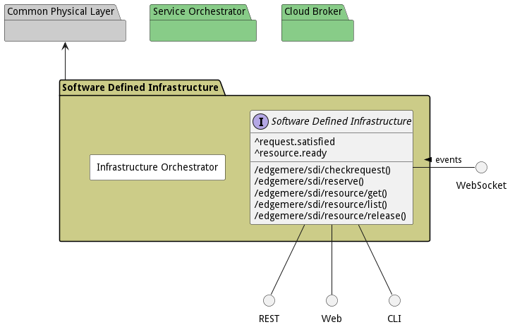

# Software Defined Infrastructure

Software Defined Infrastructure(SDI) contains the abstractions for private and public clouds. The SDI layer is a common standard interface for all cloud resources both virutal, container, and bare metal.

The Software Defined Infrastructure Layer (SDI) is a middleware layer in the architecture. And fits between the
[Common Physical](package--edgemere-cpl) and the [Distributed Information Management](package--edgemere-diml) and
[Service Management](package--edgemere-sml) layers.

It is primarily responsible for IaaS operations and management. SDI architectural elements are very well known and
established in the industry with commercial and open source product offerings available (VMWare, OpenStack, Nutanix,
etc...). The key elements to and SDI layer are Orchestration and Control, Infrastructure elements (Storage, Network,
Compute/Accelerators, and Security), and a Common Infrastructure API Gateway.

This key architectural elements are minimal viable elements for a common interface to IaaS solutions to be used in a
[Common Physical Layer](package--edgemere-cpl). The ability to interact with a common API interface reguardless of the
type of Cloud is essential for interoperability betwen the different cloud offerings both private and public. In order
to include [Edge Devices](class-device) into the ecosystem the concept of a micro cloud was developed with the same
minimal Common Infrastructure API. This concept extends the boundaries of the cloud to the edge and gives the ability to
manage infrastructure and applications across a traditionally difficult boundary.

The common infrastructure API allows Multi-Cloud Orchestrator from the
[Service Management Layer](package--edgemere-sml) to request infrastructure (Bare metal, Virtual or
containerized) to deploy complex applications across several cloud offerings.

## Use Cases

The following are the use cases of the Software Defined Infrastructure subsystem. Each use case has primary and secondary scenarios
that are elaborated in the use case descriptions.

* [Manage Resources](usecase-ManageResources)

## Users

The following are the actors of the Software Defined Infrastructure subsystem. This can include people, other subsystems
inside the solution and even external subsystems.

* [ITOperations](actor-itops)

## Interface

The subsystem has a REST, CLI, WebSocket, and Web interface. Use Cases and Scenarios can use any or all
of the interfaces to perform the work that needs to be completed. The following  diagram shows how
users interact with the system.

* [ edgemere sdi checkrequest](#action--edgemere-sdi-checkrequest)
* [ edgemere sdi reserve](#action--edgemere-sdi-reserve)
* [ edgemere sdi resource get](#action--edgemere-sdi-resource-get)
* [ edgemere sdi resource list](#action--edgemere-sdi-resource-list)
* [ edgemere sdi resource release](#action--edgemere-sdi-resource-release)

## Logical Artifacts

The Data Model for the  Software Defined Infrastructure subsystem shows how the different objects and classes of object interact
and their structure.

### Sub Packages

The Software Defined Infrastructure subsystem has sub packages as well. These subsystems are logical components to better
organize the architecture and make it easier to analyze, understand, design, and implement.

* [Infrastructure Orchestrator](package--edgemere-sdi-io)

### Classes

The following are the classes in the data model of the Software Defined Infrastructure subsystem.

* [AcceleratorResource](class-AcceleratorResource)
* [Cloud](class-Cloud)
* [ComputeResource](class-ComputeResource)
* [NetworkResource](class-NetworkResource)
* [Request](class-Request)
* [Reservation](class-Reservation)
* [Resource](class-Resource)
* [StorageResource](class-StorageResource)

## Deployment Architecture

This subsystem is deployed using micro-services as shown in the diagram below. The 'micro' module is
used to implement the micro-services in the system. The subsystem also has an CLI, REST and Web Interface
exposed through a nodejs application. The nodejs application will interface with the micro-services and
can monitor and drive work-flows through the mesh of micro-services. The deployment of the subsystem is
dependent on the environment it is deployed. This subsystem has the following environments:
* [dev](environment--edgemere-sdi-dev)
* [test](environment--edgemere-sdi-test)
* [prod](environment--edgemere-sdi-prod)

## Physical Architecture

The Software Defined Infrastructure subsystem is physically laid out on a hybrid cloud infrastructure. Each microservice belongs
to a secure micro-segmented network. All of the micro-services communicate to each other and the main app through a
REST interface. A Command Line Interface (CLI), REST or Web User interface for the app is how other subsystems or actors
interact. Requests are forwarded to micro-services through the REST interface of each micro-service. The subsystem has
the a unique layout based on the environment the physical space. The following are the environments for this
subsystems.
* [dev](environment--edgemere-sdi-dev)
* [test](environment--edgemere-sdi-test)
* [prod](environment--edgemere-sdi-prod)

## Micro-Services

These are the micro-services for the subsystem. The combination of the micro-services help implement
the subsystem's logic.

### dev

Detail information for the [dev environment](environment--edgemere-sdi-dev)
can be found [here](environment--edgemere-sdi-dev)

Services in the dev environment

* orchestrator : sdi_io
* web : sdi_web

### test

Detail information for the [test environment](environment--edgemere-sdi-test)
can be found [here](environment--edgemere-sdi-test)

Services in the test environment

* orchestrator : sdi_io
* web : sdi_web

### prod

Detail information for the [prod environment](environment--edgemere-sdi-prod)
can be found [here](environment--edgemere-sdi-prod)

Services in the prod environment

* orchestrator : sdi_io
* web : sdi_web

## Activities and Flows
The Software Defined Infrastructure subsystem provides the following activities and flows that help satisfy the use
cases and scenarios of the subsystem.

### Messages Handled

The Software Defined Infrastructure subsystem is an event driven architecture and handle several events. The following
events are handled by this subsystem. Please note that this subsystem is not the only subsystem that handles
these events.

| Message | Action | Description |
| --- | --- | --- |
| request.satisfied | Custom Action |  |
| resource.ready | /sdi/request/reserve |  |

### Messages Sent

| Event | Description | Emitter |
|-------|-------------|---------|
| acceleratorresource.create |  When an object of type AcceleratorResource is created. | AcceleratorResource
| acceleratorresource.destroy |  When an object of type AcceleratorResource is destroyed. | AcceleratorResource
| acceleratorresource.updated |  When an object of type AcceleratorResource has an attribute or association updated. | AcceleratorResource
| cloud.create |  When an object of type Cloud is created. | Cloud
| cloud.destroy |  When an object of type Cloud is destroyed. | Cloud
| cloud.updated |  When an object of type Cloud has an attribute or association updated. | Cloud
| computeresource.create |  When an object of type ComputeResource is created. | ComputeResource
| computeresource.destroy |  When an object of type ComputeResource is destroyed. | ComputeResource
| computeresource.updated |  When an object of type ComputeResource has an attribute or association updated. | ComputeResource
| networkresource.create |  When an object of type NetworkResource is created. | NetworkResource
| networkresource.destroy |  When an object of type NetworkResource is destroyed. | NetworkResource
| networkresource.updated |  When an object of type NetworkResource has an attribute or association updated. | NetworkResource
| request.create |  When an object of type Request is created. | Request
| request.destroy |  When an object of type Request is destroyed. | Request
| request.updated |  When an object of type Request has an attribute or association updated. | Request
| reservation.create |  When an object of type Reservation is created. | Reservation
| reservation.destroy |  When an object of type Reservation is destroyed. | Reservation
| reservation.updated |  When an object of type Reservation has an attribute or association updated. | Reservation
| resource.create |  When an object of type Resource is created. | Resource
| resource.destroy |  When an object of type Resource is destroyed. | Resource
| resource.updated |  When an object of type Resource has an attribute or association updated. | Resource
| storageresource.create |  When an object of type StorageResource is created. | StorageResource
| storageresource.destroy |  When an object of type StorageResource is destroyed. | StorageResource
| storageresource.updated |  When an object of type StorageResource has an attribute or association updated. | StorageResource

## Interface Details
The Software Defined Infrastructure subsystem has a well defined interface. This interface can be accessed using a
command line interface (CLI), REST interface, and Web user interface. This interface is how all other
subsystems and actors can access the system.

### Action  edgemere sdi checkrequest

* REST - /edgemere/sdi/checkrequest?request=obj
* bin -  edgemere sdi checkrequest --request obj
* js - .edgemere.sdi.checkrequest({ request:obj })

#### Description
Check the status of the request

#### Parameters

| Name | Type | Required | Description |
|---|---|---|---|
| request | obj |true | Cloud to request the Resources |

### Action  edgemere sdi reserve

* REST - /edgemere/sdi/reserve?cloud=string&amp;name=string&amp;requirements=YAML
* bin -  edgemere sdi reserve --cloud string --name string --requirements YAML
* js - .edgemere.sdi.reserve({ cloud:string,name:string,requirements:YAML })

#### Description
Reserve Resources from the SDI Layer

#### Parameters

| Name | Type | Required | Description |
|---|---|---|---|
| cloud | string |true | Cloud to request the Resources |
| name | string |true | The name of the reservation. |
| requirements | YAML |true | The Requirements to create the resource |

### Action  edgemere sdi resource get

* REST - /edgemere/sdi/resource/get?cloud=string&amp;name=string&amp;requirements=YAML
* bin -  edgemere sdi resource get --cloud string --name string --requirements YAML
* js - .edgemere.sdi.resource.get({ cloud:string,name:string,requirements:YAML })

#### Description
Get Resources from the SDI Layer

#### Parameters

| Name | Type | Required | Description |
|---|---|---|---|
| cloud | string |true | Cloud to request the Resources |
| name | string |true | The name of the Resource to create. |
| requirements | YAML |true | The Requirements to create the resource |

### Action  edgemere sdi resource list

* REST - /edgemere/sdi/resource/list?attr1=string
* bin -  edgemere sdi resource list --attr1 string
* js - .edgemere.sdi.resource.list({ attr1:string })

#### Description
Description of the action

#### Parameters

| Name | Type | Required | Description |
|---|---|---|---|
| attr1 | string |false | Description for the parameter |

### Action  edgemere sdi resource release

* REST - /edgemere/sdi/resource/release?cloud=string&amp;name=string
* bin -  edgemere sdi resource release --cloud string --name string
* js - .edgemere.sdi.resource.release({ cloud:string,name:string })

#### Description
Release Resources from the SDI Layer with the given name

#### Parameters

| Name | Type | Required | Description |
|---|---|---|---|
| cloud | string |true | Cloud to request the Resources |
| name | string |true | The name of the Resource to create. |

