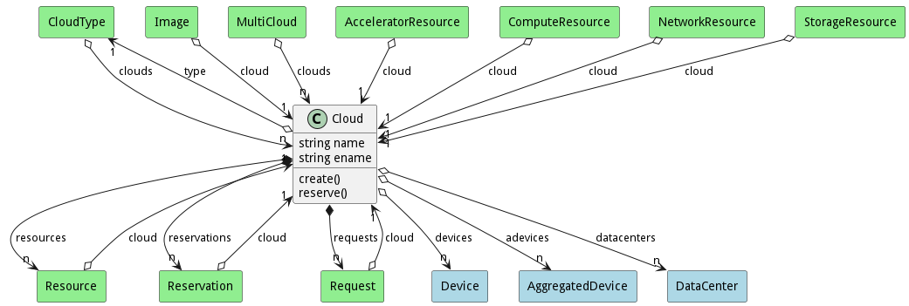

# Cloud

This represents a cloud in the ecosystem. This can be public or private onprem or offprem

## Attributes

* name:string - Name of the cloud
* ename:string - Extended name of the cloud. This gives the full path to the cloud in the system

## Associations

| Name | Cardinality | Class | Composition | Owner | Description |
| --- | --- | --- | --- | --- | --- |
| type | 1 | CloudType | false | false |  |
| resources | n | Resource | false | true |  |
| devices | n | Device | false | false |  |
| adevices | n | AggregatedDevice | false | false |  |
| datacenters | n | DataCenter | false | false |  |
| reservations | n | Reservation | false | true |  |
| requests | n | Request | false | true |  |

## Users of the Model

| Name | Cardinality | Class | Composition | Owner | Description |
| --- | --- | --- | --- | --- | --- |
| clouds | n | CloudType | false | false |  |
| cloud | 1 | Image | false | false |  |
| clouds | n | MultiCloud | false | false |  |
| cloud | 1 | AcceleratorResource | false | false |  |
| cloud | 1 | ComputeResource | false | false |  |
| cloud | 1 | NetworkResource | false | false |  |
| cloud | 1 | Request | false | false |  |
| cloud | 1 | Reservation | false | false |  |
| cloud | 1 | Resource | false | false |  |
| cloud | 1 | StorageResource | false | false |  |

## Methods
* [create() - Create the Cloud](#action-create)
* [reserve() - Reserve a resource](#action-reserve)

<h2>Method Details</h2>
    
### Action cloud create

* REST - cloud/create?name=string&amp;type=string
* bin - cloud create --name string --type string
* js - cloud.create({ name:string,type:string })

#### Description
Create the Cloud

#### Parameters

| Name | Type | Required | Description |
|---|---|---|---|
| name | string |true | Name of the cloud |
| type | string |false | Type of cloud |

### Action cloud reserve

* REST - cloud/reserve?request=object
* bin - cloud reserve --request object
* js - cloud.reserve({ request:object })

#### Description
Reserve a resource

#### Parameters

| Name | Type | Required | Description |
|---|---|---|---|
| request | object |true | Request for the reservation |

